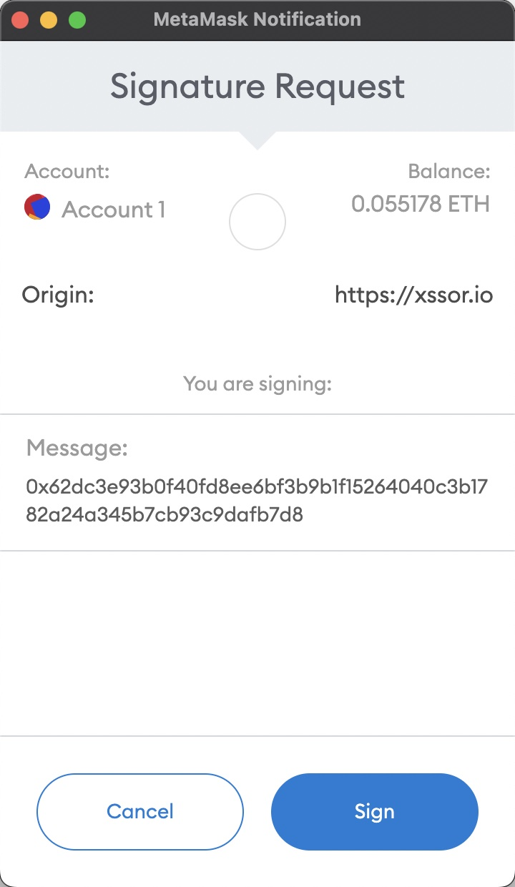
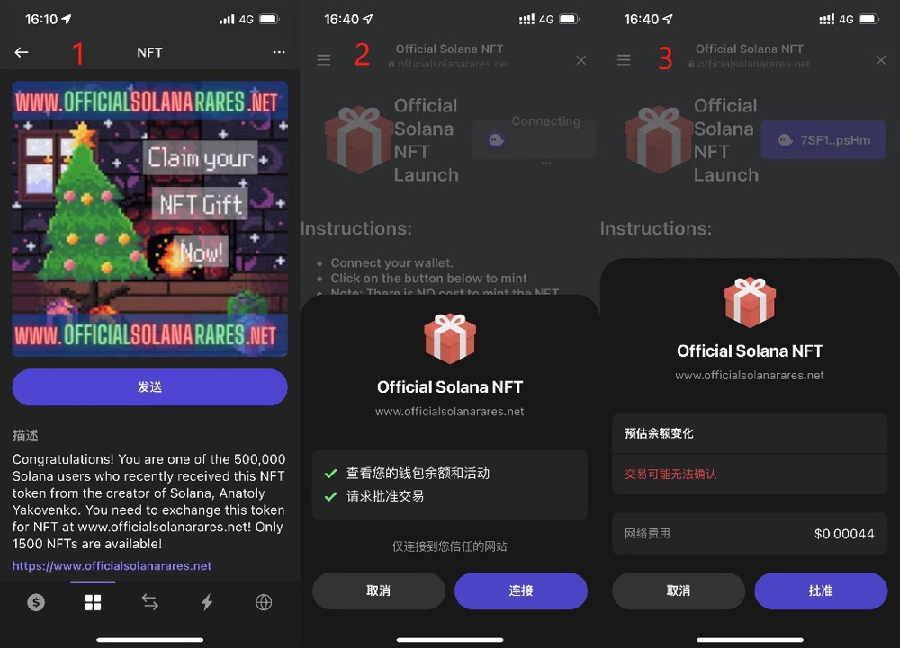

ブロックチェーンのダークフォレストにおける自己防衛のためのハンドブック<br>
*当ハンドブックの内容をマスターするということは、暗号資産におけるセキュリティをマスターするということです。<br>*

:fire:Website: https://darkhandbook.io/<br>
:us:English：[Blockchain dark forest selfguard handbook](README.md)<br>
:cn:中文版：[《区块链黑暗森林自救手册》](README_CN.md)<br>
*Note: V1, Update Logs, please see the Chinese version.*

著者: 余弦@慢雾安全团队<br>
連絡先：Twitter([@evilcos](https://twitter.com/evilcos))、Okjike(@余弦.jpg)

翻訳者＆校正者: 
>[Jack Jia](https://twitter.com/JackJia2021) | [Mia](https://twitter.com/mia_abc123)


:anchor:**Contents**
- [はじめに](#はじめに)
- [一枚の図](#一枚の図)
  - [ウォレットの作成](#ウォレットの作成)
    - [ダウンロード](#ダウンロード)
    - [ニーモニックフレーズ](#ニーモニックフレーズ)
    - [キーレス](#キーレス)
  - [ウォレットのバックアップ](#ウォレットのバックアップ)
    - [ニーモニックフレーズ/秘密鍵の種類](#ニーモニックフレーズ秘密鍵の種類)
    - [暗号化](#暗号化)
  - [ウォレットの使用](#ウォレットの使用)
    - [AML](#aml)
    - [コールドウォレット](#コールドウォレット)
    - [ホットウォレット](#ホットウォレット)
    - [DeFiのセキュリティとは、具体的にどのようなものか](#defiのセキュリティとは具体的にどのようなものか)
    - [NFTのセキュリティ](#nftのセキュリティ)
    - [署名に注意！](#署名に注意)
    - [反常識な署名に注意!](#反常識な署名に注意)
    - [一部の高度な攻撃](#一部の高度な攻撃)
  - [従来の個人情報保護](#従来の個人情報保護)
    - [オペレーティングシステム（OS）](#オペレーティングシステムos)
    - [スマートフォン](#スマートフォン)
    - [ネットワーク](#ネットワーク)
    - [ブラウザー](#ブラウザー)
    - [パスワード管理ソフト](#パスワード管理ソフト)
    - [二段階認証](#二段階認証)
    - [VPN](#vpn)
    - [電子メール](#電子メール)
    - [SIMカード](#simカード)
    - [GPG](#gpg)
    - [環境の隔離](#環境の隔離)
  - [ヒューマンセキュリティ](#ヒューマンセキュリティ)
    - [Telegram](#telegram)
    - [Discord](#discord)
    - [「公式」によるフィッシング](#公式によるフィッシング)
    - [Web3におけるプライバシー問題](#web3におけるプライバシー問題)
- [ブロックチェーン上の悪質な手口](#ブロックチェーン上の悪質な手口)
- [盗難に遭ったときの対処法](#盗難に遭ったときの対処法)
  - [まずはストップロス](#まずはストップロス)
  - [現場を守る](#現場を守る)
  - [原因を分析する](#原因を分析する)
  - [ソースの追跡](#ソースの追跡)
  - [事案をクローズする](#事案をクローズする)
- [誤解されていること](#誤解されていること)
  - [Code Is Law](#code-is-law)
  - [Not Your Keys, Not Your Coins](#not-your-keys-not-your-coins)
  - [In Blockchain We Trust](#in-blockchain-we-trust)
  - [暗号学のセキュリティは完全に安全である](#暗号学のセキュリティは完全に安全である)
  - [ハッキングされるのは屈辱的？](#ハッキングされるのは屈辱的)
  - [すぐにアップデートする](#すぐにアップデートする)
- [結論](#結論)
- [添付資料](#添付資料)
  - [セキュリティルール及び準則](#セキュリティルール及び準則)
  - [貢献者](#貢献者)
  - [公式サイト](#公式サイト)

# はじめに

まずは、あなたがこのハンドブックに出会えたことを祝いましょう。 あなたが誰なのかはわかりませんが、もしあなたが暗号資産を保有していたり、この世界に興味があり、今後において暗号資産を保有する可能性があるなら、このハンドブックは何度も読み返し、注意しながら実践する価値があると思います。
 
必要な心構えは、このハンドブックを読むにはある程度の知識が必要であるということです。初心者にも対応するようにしているものの、やはり難しいと思います。 しかし初心者の方でも「遊べる」部分は多いので、このような知識の壁を恐れないで欲しいと思います。 分からないことがあったり、深掘りする必要がある場合には、Googleを利用することをお勧めします。また、セキュリティの基本として、インターネット上のすべてのことについて、少なくとも2つの情報源を参照し互いに裏付けを取った上で、常に懐疑的な視点を持つことを強くお勧めします。
 
そう、常に懐疑的になることです。 このことは、このハンドブックに記載されているあらゆる知識に対しても言えることです :)
 
ブロックチェーンは偉大な発明であり、生産関係を変化させ「信頼」という価値あるものを部分的に解決することを可能にしました。 中央集権も第三者の必要性もなく、いくつかの「信頼」はブロックチェーンに基づき非常に上手く担保されています。例えば、改ざんが不可能であること、合意によって実施されること、偽りを防ぐことなどです。しかし、現実は厳しく、ブロックチェーンに対する誤解も少なくありません。このような誤解から、悪者は簡単に抜け道を利用して頻繁に人々のウォレットから金銭を盗み、多額の経済的損失をもたらしています。ブロックチェーンは、昔からダークフォレストです。
 
ブロックチェーンというダークフォレストの世界で、まず念頭に置くべきは、この2つのセキュリティルールです：

1. **ゼロトラスト**：簡単に言うと、常に懐疑的であり続けることです。
2. **継続的な検証を行う**: 信頼するためには、懐疑的な点を検証する能力を持ち、この能力を習慣化することが必要です。

*注：本ハンドブックのセキュリティルールはこの2つであり、それ以外はすべてこの2つのルールから成り立つセキュリティ準則です。*

さて、入門編はここまでです。 このダークフォレストに入り、どのようなリスクに晒されているのか、またどう対処すべきなのか、まずは一枚の図から考えましょう。

# 一枚の図


この図にざっと目を通してから後の文章を読むとよいでしょう。この世界（ブロックチェーン、暗号資産、Web3など呼び方は何でもいい）におけるあなたの主な行動を、「ウォレットの作成」、「ウォレットのバックアップ」、「ウォレットの使用」の大きな3つの部分に分けて図式化したものです。
 
ここではこの3つの主なプロセスを追いながら、それぞれのポイントを解説していきます。

## ウォレットの作成

ウォレットの最も中心的なものは秘密鍵（またはニーモニックフレーズ）です。

秘密鍵は以下のようなものです：

>0xa164d4767469de4faf09793ceea07d5a2f5d3cef7f6a9658916c581829ff5584

ニーモニックフレーズは以下のようなものです：

>cruel weekend spike point innocent dizzy alien use evoke shed adjust wrong

*注：イーサリアムチェーンを例としてあげています。秘密鍵/ニーモニックフレーズに関する基礎知識は各自で調べてください。*

秘密鍵はIDと同じであり、仮に秘密鍵を紛失したり盗まれたりすると、そのIDはあなたのものではなくなります。実はウォレットアプリはたくさんあり、有名なものも多いので、すべてを網羅することはできません。ハンドブックでは特定のウォレットについて言及しており、必然的に私が基本的に信頼しているものではありますが、利用中に発生するセキュリティ上の問題や、対象のウォレットが私の想定外のセキュリティリスクを抱えている可能性があるので、100％の安全とは保証できないことをご了承ください（後の文書の中では繰り返し述べないので、冒頭に述べた2つのセキュリティルールを是非とも覚えておいていただきたいです）。
 
用途としては、PCウォレット、ブラウザ拡張ウォレット、モバイルウォレット、コールドウォレット、WEBウォレットなどがあります。インターネットにアクセスできるかどうかという点では、主にコールドウォレットとホットウォレットの二つに分けられます。ブロックチェーンの世界に入るときはまず、自分が持つウォレットの目的を考えなければなりません。目的によって、どのウォレットを使うか、またどう扱うかが決まります。
 
どのようなウォレットを選ぶにせよ、少なくともひとつ言えることは、この世界で長く遊んでいると、ひとつの財布だけでは物足りなくなってくるということです。

そこでは同じ卵を同じカゴに入れないこと、つまり、もう一つのセキュリティ準則である「分離」をしっかりと行ってください。ウォレットの使用頻度が高いほど、何かしらの問題が発生するリスクは高くなります。常に覚えておいてほしいのは、新しいことに直面したら、別のウォレットを用意し、しばらくは少額のお金で遊んでみることです。私のような様々なことを経験し、問題点も既に理解している人でないのであれば、別のウォレットを用意することをお勧めします。しかし、例え私のような人であっても、常にこの世界にいる限りは100％問題がないとも言えません。

### ダウンロード

簡単なように思えて、実はそんなに簡単な話ではありません。原因は：

1. 多くの人（実に多くの人）が正しい公式サイト、正しいアプリマーケットプレイスを見つけることができず、偽のウォレットをインストールしている。
2. ダウンロードしたアプリが改ざんされているかどうかを確認する方法を知らない。

このようであれば、ブロックチェーンの世界に入る前にウォレットの中身は空っぽになってしまいます。
 
上記1について、正しい公式サイトを見つけるには、次のようなコツがあります：

* Google（検索結果の広告項目に注意してください。非常に頼りになりません）
* CoinMarketCapのような業界で有名な企業
* より多くの信頼できる人に聞く

上記のような複数の方法で得られる情報は、すべて組み合わせたり参照したりすることで、互いに裏付けを取ることができます。そして最終的に真実は一つしかないはずです :) おめでとう、あなたは正しい公式WEBサイトを見つけることができました。

次に、アプリケーションのダウンロードとインストールについて、 **PCウォレットの場合は**、 公式サイトに記載されているダウンロードリンクに従ってダウンロードした後に、自身でインストールする必要があります。これによって、ソースが完全に改ざんされること（公式サイトがハッキングされたり、内部関係者にハッキングされたり、公式サイトが置き換えられたりなど）は防げませんが、ソースの一部が改ざんされたり、第三者に乗っ取られたりすることは防げます。
 
改ざんのチェックは、実は、ファイルにおける整合性のチェックといえます。一般的には2つの方法があります：

* **ハッシュチェック**: 例えばMD5やSHA256など。大体はMD5で十分ですが、極めて低いもののハッシュ衝突のリスクがあるため、一般的に業界では十分かつ安全なSHA256を選択しています。
* **GPG署名検証**: 実はこれも非常に人気があります。GPGのツールとコマンド、方法をマスターすることを強くお勧めします。初めての人にとっては少し難しいですが、慣れることができれば非常に便利な方法だと思います。

とはいえ、このように実施しているプロジェクトオーナーは多くはなく、珍しいです。例えば、Sparrow Walletというビットコインウォレットは非常に良心的であり、ダウンロードページの「リリースの検証」には両方の方法について明確なガイドラインが記載されています。以下のサイトで直接参照することができます：

>https://sparrowwallet.com/download/

このページで紹介されているGPGツールは2つあります：

* MacOSで動作する「GPG Suite」
* Windowsで動作する「Gpg4win」

よく見ると、両GPGツールのダウンロード関連ページに二つの方法の整合性チェックの説明が書かれているのですが、残念ながら一つ一つ細かくは解説されていません。必要な知識はすでに持っていることが前提なんでしょうね :)

**ブラウザ拡張ウォレットの場合**、例えば世界的に有名なMetaMaskなど、対象となる拡張機能のダウンロードページでユーザー数やその評価を目にする機会があります。例えば、MetaMaskはChrome App Storeでのユーザー数が1,000万人以上、ユーザー評価は2,000以上ありますが、最終評価はそれほど高くはありません。これは恣意的に評価を上げることはできないのでしょうか？ 確かにできるとは思いますが、これほどの評価の量を操作するのは馬鹿馬鹿しいはずです。

**モバイルウォレットの場合は** 、判断方法はブラウザ拡張ウォレットと同様ですが、注意すべきは、iPhone App Storeは地域ごとに区分されており、中国本土では暗号資産は利用できないため、App Store中国アカウントでウォレットをダウンロードした場合のアドバイスはただ一つ、使わないでください。例えば米国App Storeアカウントに切り替えてダウンロードしてください。または正しい公式サイトが正しいダウンロード先に誘導してくれるはずです（世界的に有名なimTokenやTrust Walletなどの公式サイトのセキュリティは厳重になっていなければならず、もし公式サイトがハッキングされた場合は、本当に重大なセキュリティ問題となります）。

**コールドウォレットの場合は**、簡単に言うと、公式サイトで購入し、直接オンラインストアにアクセスしないこと、また手元に届いた後で第三者に加工されたことがあるかどうかを注意しなければなりません。当然、ハードウェアのパッケージの加工が非常に巧妙なので、プロでも必ずしも見つけることはできません。現時点でのアドバイスは、使用する際は、まず最低3回連続でゼロから作成した時に生成されたニーモニックフレーズやウォレットアドレスが繰り返し生成されないのであれば問題はありません。

**ウェブウォレットの場合は**、やむを得ない場合を除き、オンラインウォレットを使用することは非常にお勧めしません。どうしても使用したい時は、公式なものであることを確認し、最低限の利用に留めておいてください。

### ニーモニックフレーズ

一般的に、ウォレットを作成した後に直接扱う重要な情報はニーモニックフレーズ（秘密鍵ではない）です。これは人間が覚えやすいようにするためのものであると言えます。ニーモニックフレーズには標準規格（例えばBIP39など）があり、一般的には12個英単語、または他の数量（3の倍数）でありますが、24個以下でないと複雑すぎて覚えられないと思います。12個以下はセキュリティ上信頼できず、12、15、18、21、24個は問題ありません。しかし、業界の慣行としては、セキュリティ的に十分である12個が一般的であり、Ledgerなどのような安全性基準が高いコールドウォレットでは24個です。英単語だけでなく、中国語や日本語、韓国語など、他の言語の単語もあり得ます。しかし、どんな単語でも使えるわけではなく、2,048個の決まった単語リストから選ばれており、以下のサイトで見ることができます：

>https://github.com/bitcoin/bips/blob/master/bip-0039/bip-0039-wordlists.md

ウォレットを作成する場合、ニーモニックフレーズの表示は非常にデリケートなので、周囲に人やカメラなど、覗き見の対象になりそうなものがないかを確認してください。
また、単語が十分にランダムに表示されるかどうかを確認してください。通常、これらの有名なウォレットによって生成された単語は十分なランダムなはずですが、念のため確認してください。手にしたウォレットが怪しくないのかどうかは、本当にわかりません。これを面倒と思わずに実施し、この小さなセキュリティの習慣が形成されれば、今後において非常に役に立つと思います。最後に、ウォレットを作成する際にインターネットから切断することも一つの方法です。特に、そのウォレットをコールドウォレットとして使用する場合は、インターネットから切断するのが一番効果があります。

### キーレス

キーレスとは、その名の通り秘密鍵がないことを意味します。ここでは、キーレスを大きく2つのシナリオに分けます（ここでの区別は、業界で認められている方法ではなく、あくまで説明を容易にするためのものであることに注意してください）。

* **カストディアル（Custodial）**.：例えば中央集権的な取引所やウォレットの場合、ユーザーはアカウントを登録するだけで、秘密鍵を所有することはなく、セキュリティはすべて中央集権的なプラットフォームに依存することになります。
* **ノンカストディアル（Non-Custodial）**：ユーザーが秘密鍵のようなものを持つだけで、直接的にウォレットの秘密鍵（またはニーモニックフレーズ）を持つわけではありません。例えば、カストディアルと認証業務において有名なクラウドプラットフォームに依存する場合、有名なクラウドプラットフォームは脆弱点となります。また、単一リスクのない安全なマルチパーティーコンピュテーション（MPC）を採用するとともに、評判が良いクラウドを取り入れ、最高のユーザーエクスペリエンスを実現しています。

私の場合、キーレスにおける方法のいくつかを使っています。実績があり、評判の高い中央型プラットフォームではユーザーエクスペリエンスが良く、自身の原因による盗難ではない限り（例えば、アカウントに関連するアクセス権限が盗まれたなど）、これらのプラットフォームが全額賠償します。MPCベースのキーレスソリューションについては、非常に有望であり、一刻も早く普及させるべきだと思います。例えば、私が利用したことがあったZenGo、Fireblocks,Safeheronなどです。メリットは明白なので、いくつか簡単に紹介します：

* MPCアルゴリズムのエンジニアリングにおける実践はこれらの有名なブロックチェーン上で成熟しつつあり、秘密鍵に対してのみ暗号化すれば良いです。
* 同じ方法では、ブロックチェーンごとに異なる膨大なマルチシグネチャーのスキーム問題を解決することで、ユーザーの体験を統一化します。いわゆる「ユニバーサルマルチシグネチャー」と呼んでいるものです。
* 本物の秘密鍵が決して現れないようにし、マルチパーティーコンピューテーションによって単一リスクを解決しています。
* よく知られたクラウド（あるいはWeb2）と組み合わせることで、MPCは安全なだけではなく、よりスムーズな体験を提供してくれます。

メリットは明らかですが、デメリットもあるので、いくつか簡単にご紹介します：

* この分野の成熟度として、業界での通用標準を満たしてオープンソースとなるにはまだまだ不十分であり、やるべきことがあります。
* 基本的にイーサリアムチェーン（またはEVMベースのブロックチェーン）しか使わない人が多く、Gnosis Safeのようにスマートコントラクトによるマルチシグネチャーのソリューションで十分、という人も少なくないでしょう。

いずれにせよ、自分が安全に使えると思えばそれで良いと思いますし、意見が分かれるところではあります。
 
さて、ウォレットの作成に関連するセキュリティの問題点は以上です。一般的なセキュリティの問題については後で説明しますので、急ぐ必要はありません :)

## ウォレットのバックアップ

私を含め、非常に優秀な人でもここには注意していないかもしれません。正直に言うと、私もずっとウォレットを使用しているなかで、失敗したことがあります。幸い大きな資産を持っているウォレットではないので、結局はSlowMistの仲間に助けてもらい、解決しました。うまくバックアップできず問題になりましたが、それを直してくれる素晴らしい人がいました。しかし、ヒヤヒヤしました。もしあなたがヒヤヒヤする感覚が嫌いなら、ウォレットを安全にバックアップする方法を学びましょう。

### ニーモニックフレーズ/秘密鍵の種類

ウォレットのバックアップといえば、ニーモニックフレーズ（または秘密鍵。説明しやすいため、後述ではニーモニックフレーズのみ記載）のバックアップを指します。 私たちが持っているニーモニックフレーズは、実は大きくいくつかの種類に分けることができます：

* プレーンテキスト
* パスワード付き
* マルチシグネチャー
* Shamir's Secret Sharing（略称：SSS）

これらのタイプについて、簡単に説明します。

**プレーンテキスト**、非常にわかりやすく、12個の英単語を取得した後、その中の資産は自分のものになります。実は順番を特別に「ごちゃまぜ」にすることや、ある言葉を別の言葉に置き換えることもできます。これは悪者にとって厄介なことではありますが、自分が「ルール」を忘れたら、今度は自分が大変な目に合います。自分が大変な目には合わないと思い込まないでください。1年後、2年後、5年後の記憶は、不確かになるはずです。私は数年前にLedgerのコールドウォレットを使う際、ニーモニックフレーズの24個の単語の順番をぐちゃぐちゃに入れ替えました。数年後、その順番を忘れてしまい、どの単語を入れ替えたのか思い出せなくなりました。私の問題は前述のように、後に特殊なクラッキングプログラムによってニーモニックフレーズの正しい順序を見つけ、いくつかの単語を修正することで助かりました。

**パスワード付き**、規格によれば、ニーモニックフレーズにパスワードが付けられます。ニーモニックフレーズはそのままですが、パスワードを付けたら別のシードを取得し、シードを使って一連の秘密鍵と公開鍵およびアドレスを生成できます。このとき、ニーモニックフレーズだけでなく、パスワードも忘れないようにバックアップしてください。ちなみに、パスワードに付随するニーモニックフレーズ以外に、秘密鍵に関連する規格（例えば、BIP38など）や、イーサリアムチェーンシリーズに共通するKeystoreファイルなどがあります。

**マルチシグネチャー**、対象資金の使用にあたり、複数の署名による承認を必要とすることであると理解できます。例えば、3人が鍵（ニーモニックフレーズまたは秘密鍵）を持っている場合、対象資金を使用する前に少なくとも2人の承認を満たす必要があるなどの方針を柔軟に設定できます。各ブロックチェーンは独自のマルチシグネチャーのソリューションを持っているでしょう。有名なビットコインのウォレットはすべて元々マルチシグネチャーをサポートしています。このような一般的なマルチシグネチャーの他に、MPC（Secure Multi-Party Computation）という、従来のマルチシグネチャーに近いものの、原理が大きく異なるタイプも普及しています。MPCは、チェーンごとに異なるマルチシグネチャーの方式を必要とせず、ユニバーサルなマルチシグネチャーを実現することができます。

**SSS**, シードを複数のスライス（1スライスあたり20単語が一般的）に分割し、ウォレットを復元する際に、指定された数のスライスを使用する必要があります。業界におけるベストプラクティスを参照してください：

>https://support.keyst.one/v/chinese/gao-ji-gong-neng/zhu-ji-ci/chuang-jian-dao-ru-fen-pian-zhu-ji-ci<br>
>https://wiki.trezor.io/Shamir_backup

マルチシグネチャー、SSSのようなソリューションを利用すればより安心感があり、単一リスクを回避できますが、管理も比較的複雑であり、これには複数の人が関わることが多いです。利便性と安全性は常に相反するので、どっちを重視するのかはあなた次第です。 しかし、ルールや準則を怠ってはいけません。

### 暗号化

暗号化というのは非常に大きな概念で、対称型であろうと非対称型であろうと、何年後かにあなたや、あなたをサポートする人が簡単に解読でき、かつ他の誰も解読できないような方法で暗号化されていればよいです。
 
「ゼロ・トラスト」というセキュリティルールによれば、私たちがウォレットのバックアップをするとき、あらゆる段階において、金庫などの物理的な環境が危険にさらされることを想定しなければなりません。自分以外は完全に信用できず、自分自身も信用できない可能性があることを忘れないでください。例えば自分の記憶が薄れたり無くなったりすることがあります。でも、この世界はそこまで怖いと思わなくても大丈夫です。
 
バックアップの際には、特にディザスターリカバリー（災害復旧）を意識してください。 ディザスターリカバリーとは、主に一点集中型によるリスクを回避することです。もし、バックアップ先がある環境がなくなってしまったらどうするのか？それは、復旧担当者を置くこと、重要なものは複数バックアップしておくことが重要です。
 
復旧担当者は信頼できる人に依頼しましょう。複数のバックアップについて解説します。バックアップの基本的な形態についていくつか見てみましょう：

* クラウド
* 紙
* デバイス
* 脳

**クラウド**：クラウドバックアップというと、すぐにハッキングされるイメージも多いですが、それは違います。実は、攻撃と防御の戦いは、人材であれ資金であれ、誰が最も多く投資するかによって、つまり常にコストの戦いになります。私としては、Google、Apple、Microsoftなどが提供する関連クラウドサービスを信頼しています。なぜなら、彼らのセキュリティチームがいかに強力で、セキュリティにどれだけ投資しているかを知っているからです。しかし、外部のハッカー対策とは別に、社内のセキュリティ管理能力やプライバシーデータ保護についても気になるところです。私が信頼している数少ない企業は、私が懸念しているセキュリティリスクを回避するために、努力しています。 しかし、絶対的な安全はありません。もし私が非常に重要なデータ（ウォレットなど）をバックアップするためにこれらのクラウドのうちの1つを選ぶとしたら、間違いなくウォレットをもう1度暗号化します。

GPGは、前述の「シグネチャーチェック」の目的に加え、暗号化・復号化の面でもセキュリティが十分強いので、ぜひ勉強してください。GPGの紹介は以下です：

>https://www.ruanyifeng.com/blog/2013/07/gpg.html

さて、あなたはGPGをマスターしました :) 安全なオフライン環境でGPGを使ってウォレット（ニーモニックフレーズまたは秘密鍵）を暗号化したので、暗号化したファイルをこれらのクラウドサービスに直接アップロードすることで安全に保つことができます。しかし、GPGの秘密鍵を失くさないように、また秘密鍵のパスワードを忘れないようにしてください・・・。
 
この時点で、セキュリティの面倒さに慣れることはできないでしょう。GPGを使い始めても、GPGの秘密鍵と秘密鍵のパスワードはバックアップしておかなければならないため大変です。もしここまで来て慣れてきたのなら、この程度のバックアップは問題ないでしょう。この点については、実際にやってみることで学んでいただきたいと思います。
 
もし怠けたいのであれば、もう一つ方法がありますが、少し安全性に欠けます。有名なツールを使ってサポートします。このツールは1Passwordです。新バージョンの1Passwordは、ニーモニックフレーズ、パスワード、ウォレットアドレスなど、ウォレット関連のコンテンツの直接保存に対応し、ユーザーにとって一層使いやすくなりました。他にも（Bitwardenなど）ありますが、使い勝手はあまりよくありません。

**紙**：多くのコールドウォレットには数枚の良質な紙カードが付属されており、ニーモニックフレーズ（プレーンテキスト、SSSなどの形式）を書き写すことができます。紙だけでなく、鉄板（耐火・耐水性を持つ。私は検証していない）もあります。ニーモニックフレーズを書き写し終えたら、検証された後に安全と思われるところ（例えば、金庫などの安全な場所）に保管します。実は、個人的には「紙」が好きです。 環境さえ整えば、電子機器よりもずっと長持ちします。

**デバイス**：あらゆる種類のデバイス、電子デバイスが一般的に使用され、コンピュータ、iPad、iPhone、モバイルハードディスク、USBドライブなど、個人の好みに応じて、すべてバックアップに使用できます。デバイス間の安全な伝送には、仲介者に乗っ取られる可能性の低いAirDropやUSBなどのPeer to Peer方式の方が安心感があります。電子機器において当然不安なのは、年数が経つと故障することなので、少なくとも年に一度は点検してください。

**脳**：脳の記憶というのは、クールでエキサイティングです。誰もが自分の「記憶の宮殿」を持っています。実際に鍛えることができ、練習すればより完璧になり、記憶力が深まります。覚えておくと本当に良いことはたくさんありますが、脳だけを使って覚えられるかどうかは自分次第です。とにかく、時間が経つと記憶が薄れて間違ってしまうことと、事故に遭うことの2つのリスクに気をつけてください。
 
これでバックアップは万全です。暗号化しすぎると、自分で復号できなくなる可能性があります。セキュリティのルールである「継続的な検証」に則すれば、暗号化やバックアップをどんなに過剰に行っていても、記憶力次第では一日の終わりには忘れてしまうこともあるので、定期的かつ不定期に検証する必要があります。必ずしも全てを復号する必要はなく、全体がエラーにならなければ部分検証でも可能です。最後に、検証作業における機密性と安全性に注意してください。
 
さて、一息つきましょう。そもそも始めることが一番難しかったとは思いますが、上記のすべての準備が整った後は、このダークフォレストに実際に入ってみましょう :)

## ウォレットの使用

ウォレットの作成とバックアップが完了したら、いよいよ本格的なチャレンジです。 自分の資産をほとんど利用せずにDeFiやNFT、GameFiあるいは今人気のWeb3などのスマート・コントラクト関連のプロジェクトを使用しない限り、実はあなたのお金は非常に安全なのです。

### AML

あくまで「非常に安全な状態」を求めるのであれば、ここにもリスクがあります。なぜ、そんなことを言うのだと思いますか？考えてみてください。最初の暗号資産はどこから手に入れたのでしょうか？ 何もないところから現れたわけではありません。暗号資産に関する取引の場合、入手した暗号資産はAML（アンチ・マネー・ローンダリング）の対象となる可能性があります。つまり、今保有している暗号資産がクリーンでない可能性があり、運が悪ければブロックチェーン上で直接凍結されることもあります。例えばテザー社のケースでは、法的機関の要請により一部のUSDT資金が凍結されたことがあります。凍結された資金の一覧はこちらで見ることができます：

>https://dune.xyz/phabc/usdt---banned-addresses

テザー社による凍結の有無の確認は、USDTのコントラクトアドレスで行うことができます：

>https://etherscan.io/token/0xdac17f958d2ee523a2206206994597c13d831ec7#readContract


isBlackListedに判断したいアドレスを入力すれば良いです。他のチェーンでのUSDTも同様です。
 
でも、皆さんのビットコインやイーサリアムは、オンチェーン上で凍結することはないでしょう。もし将来そうなったら、分散化に対する非常に強い信念はなくなってしまうかもしれません。我々が聞いたことがある暗号資産の凍結の大半は、実はオンチェーンで起きているわけではなく、中央集権型の取引所（Binance、Coinbaseなど）などのプラットフォーム上で起きています。暗号資産が中央集権によって管理されたプラットフォームにあるということは、プラットフォームがあなたの口座、特に取引と出金の権利を凍結しているという意味であり、あなたが実際に暗号資産を保有しているわけではないことを意味します。凍結という概念は、ブロックチェーン業界以外の人に誤解されやすく、そのため、非常に悪質なメディアがビットコインについて様々な陰謀論を解釈し、広めていることがあります。
 
あなたのビットコイン、イーサリアムなどがチェーン上で凍結されることはありませんが、あなたの暗号資産自体が、法的機関が関わっている事件に関与している場合は、あなたの暗号資産が中央集権型プラットフォームに送金されると、これらの中央集権型プラットフォームはAMLやその他の要件に基づき暗号資産を凍結する可能性があります。
 
AML問題を回避するためには、取引相手として評判の良いプラットフォームや個人などを選択する必要があります。基本的に大きな問題は起こらないはずなので、変な取引をしないでください。もっとこのような問題を深く追求しようと思えばできます。例えば、イーサリアムチェーンでは、ほとんど全ての悪人やプライバシーを気にする人々は、コインミキシングにTornado Cashを選んでいます。それ以上の方法は、実際に悪用される可能性があるため、ここでは述べません。

### コールドウォレット

コールドウォレットの使い方はいくつかあり、ウォレット自体がインターネットに接続されていない場合は、コールドウォレットとみなされます。では、インターネットに接続されていない状態でどのように使うのでしょうか。まず、暗号資産を受け取るだけなら大したことはないので、ウォレットをモニタリングするだけで十分です。例えば、imToken、Trust Walletなどをウォレットアドレスに直接追加すればモニタリング専用ウォレットになります。
 
コールドウォレットが暗号資産を送りたい場合、いくつかの方法があります：

* QRCode
* USB
* Bluetooth

いずれも、前述のモニタリング専用ウォレットを含む上記のいくつかの方法を使用するには、専用のアプリケーション（ここではLight Appと表記）が必要です。 私たちは、これらの手法の本質を理解すればいいのです。要するに、最終的には署名されたコンテンツをブロックチェーンにアップデート（ブロードキャスト）する方法を考えるだけです。ざっくりとした流れを説明します：

* 署名する内容は、これらの方法（QRCodeなど）でLight Appからコールドウォレットに送信される。
* 署名は秘密鍵を持つコールドウォレットが担い、これらの方法でLight Appに送り返される。
* Light Appは、署名されたコンテンツをブロックチェーンにブロードキャストする。

つまり、QRコードであれ、USBであれ、Bluetoothであれ、目的は上記の通りです。もちろん、QRコードの情報容量には制限があり、大きな署名データになると分割しなければならないなど、方式によって細かな違いはあります。
 
こういう方法はちょっと面倒そうですが、慣れてしまえば安心感が増します。しかし、満足してはいけません。ここにはまだリスクがあり、そのリスクによって損失を被るケースも少なくなりません。リスクポイントとしては：

* コインの送金先のアドレスが厳密にチェックされないことにより、結果的に他の人に送金してしまうこと。人間は慢性的かつ惰性的なので、例えば、ウォレットのアドレスの最初と最後の数桁が正しいかどうかだけを確認し、完全なチェックをしません。そこに悪者は目をつけ、最初と最後の数桁が同じアドレスを作るプログラムを使い、コイン送金のターゲットアドレスを、何らかのトリックで彼がコントロールするアドレスに置き換えます。
* あるコインに対して未知のアドレスに使用権限（Approve、承認とも言えます）を与えること。一般的な承認は、イーサリアムチェーン系統（イーサリアムチェーン及びEVMサポートチェンの意味）のスマートコントラクトのトークンの仕組みで、一つの引数は対象アドレスへの使用権限の承認、もう一つの引数は数量とするApprove関数です。多くの人はこの仕組みを理解しておらず、ターゲットアドレスに無制限のトークン使用権限を認可し、ダーゲットアドレスはこの権限を利用してこれらのトークンを転送します。これは承認権限によるトークンの盗難と呼ばれるが、この手法の他のパターンもあるため、ここでは述べません。後ほど説明します。
* 一見どうでも良いような署名は、実は重大な巨大なトラップであることがあります。これについても後ほど説明します。
* コールドウォレットは、必要な情報が十分に表示されないため、ユーザーが油断して判断を誤ることがあります。

上記のことは、全て2つのことに集約できます：

* ユーザーが見たことに対してのみユーザーが署名するというインタラクション自体が安全性に欠けている。
* ユーザー側にセキュリティに関する知識が不足している。

### ホットウォレット

コールドウォレットと比較して、ホットウォレットは基本的にコールドウォレットが持つすべてのリスクを持っていますが、1つ追加されたリスクは、ニーモニックフレーズ（または秘密鍵）が盗まれるリスクです。ホットウォレットは、PC環境のセキュリティなどの考慮すべき点が多くなります。もしPC内がウイルス🦠に感染しているなら、盗難の危険性があります。また、ホットウォレットには脆弱性があり、その脆弱性が悪用され直接トークンが盗まれる可能性もあります。
 
通常のトークンの送金機能に加え、DApp（DeFi、NFT、GameFiなど）とやり取りするためには、ホットウォレットはブラウザで直接アクセスするか、PCブラウザで開いたDAppとWalletConnectプロトコルを通じてアクセスできます。

*注：本書でいうDAppとは、イーサリアムチェーン系統上で作動するスマートコントラクトプロジェクトを指します。*

普通の状況では、ウォレットのセキュリティ自体に問題がない限り、このようなインタラクションがニーモニックフレーズの盗難につながることはありません。当社のセキュリティモーニタリングやセキュリティ調査の履歴から見ると、ウォレットニーモニックフレーズがターゲットページの悪意のあるJavaScriptによって直接盗まれる危険性があります。しかし、実際には非常に低レベルのセキュリティ問題であり、有名なウォレットで発生する可能性は低いです。
 
私が一番心配することは、上記のどれでもなく、よく知られたウォレットにおける毎回のアップデートにおいて悪意のあるコードやバックドアが仕込まれていないことをどう保証するかということです。要するに、私は現在のバージョンのウォレットにセキュリティ上の問題がないことを確認した上で安心して使っていますが、次のバージョンはどれほど安全かはわかりません。そもそも私や、私のセキュリティチームが全てを確認する時間はありません。
 
CoPayや直近ではATokenなど、悪意のあるコードやバックドアによるトークンの盗難事件がいくつか発生していますので、ご自身で検索してみてください。
 
このような悪用について、大きくいくつかの手法に分けられます：

* ウォレットが稼働しているとき、悪質なコードが関連するニーモニックフレーズをパッケージ化し、ハッカーが管理するサーバーに直接アップロードする。
* ウォレットが稼働しているとき、ユーザーが送金を開始すると、送金先のアドレスや金額などの情報がバックエンドで密かに置き換えられ、ユーザーには発見しにくい仕組みになっている。
* ニーモニックフレーズの生成に関連する乱数のエントロピー値を破壊することで、ニーモニックフレーズをクラッキングする。

セキュリティとは無知な人は怖がらず、知識のある人が怖がるものです。ゆえに、大切な資産を入れるウォレットのセキュリティは、安易なアップデートをせず、使えるのであればそのままにしておくというのが私のルールです。

### DeFiのセキュリティとは、具体的にどのようなものか

DAppsというと、DeFi、NFT、GameFiなどがありますが、セキュリティはほとんど同じであるもののそれぞれ特徴があります。DeFiを例として、DeFiのセキュリティという言葉の本当の意味を説明します。業界ではほとんどスマートコントラクトの部分しか見ておらず、スマートコントラクトが安全であれば全て問題ないと思われているようですが、実際はどうなのでしょうか？
 
DeFiのセキュリティは、少なくとも以下の部分を含みます：

* スマートコントラクトのセキュリティ
* ブロックチェーン基盤のセキュリティ
* フロントエンドのセキュリティ
* 通信のセキュリティ
* ヒューマンセキュリティ
* 金融のセキュリティ
* コンプライアンスのセキュリティ

**スマートコントラクトのセキュリティ**

スマートコントラクトのセキュリティは、まさにセキュリティ監査において最も重要なエントリーポイントであり、SlowMistでのスマートコントラクトのセキュリティ監査ポイントは、以下のとおりです：

>https://www.slowmist.com/service-smart-contract-security-audit.html

上級者にとっては、スマートコントラクトの部分のセキュリティ自体がコントロールできれば（自分でしっかり監査できるか、専門機関のセキュリティ監査報告書を読めるのであれば）、それ以外のセキュリティはどうでもいいでしょう。コントロール可否については、非常に変化しやすく、プロジェクトの実力（大手企業かどうかなど）に依存する部分もあります。例えば、スマートコントラクトの権限が過剰になるリスクについては、プロジェクト先が強力で良い評判があるのであれば、完全な中央集権でもよいでしょう。しかし、あまり知られていないプロジェクト先、または新しいプロジェクト先については、プロジェクトのスマートコントラクトの権限が大きすぎる場合、特にその権限がユーザーの元本や収益にも影響を及ぼすのであれば、誰でも嫌です。
 
過剰な権限は非常に微妙で、ガバナンスの利便性やリスクに対する緊急対応において、プロジェクト先にとって都合の良いものが多いでしょう。しかし、私たちにとっては、プロジェクト先が悪人だったらどうするべきでしょうか？こういった人的な配慮が必要です。そこで業界では、過剰な権限に対応するために時限錠（Timelock）を追加するなどの妥協案が出されています。例えば以下です：

> 古くからある有名なDeFiプロジェクトであるCompoundは、スマートコントラクトのコアモジュールであるComptrollerと、Governanceの管理者権限にTimelock機能を追加しています。<br>
> Comptroller(0x3d9819210a31b4961b30ef54be2aed79b9c9cd3b)<br>
> Governance(0xc0da02939e1441f497fd74f78ce7decb17b66529)<br>
> の管理者アドレス:<br>
> Timelock(0x6d903f6003cca6255d85cca4d3b5e5146dc33925)

ブロックチェーン上で直接確認できるTimelock（delayパラメーター）は、48時間（172800秒）です。


つまり、Compoundの管理者（プロジェクト先）が対象のスマートコントラクトのいくつかのキーの値を変更する必要がある場合、トランザクションはいったんログに記録されます。しかし、トランザクションが確定して実行できるようになるまで48時間待たなければなりません。つまり、あなたが望めば、管理者が行ったすべての行動を監査することができ、少なくとも48時間以内に対応できます。例えば、不安な場合は48時間以内に資金を出金することができます。
 
また、プロジェクト先が権限を過剰に持つリスクを軽減する方法として、例えばGnosis Safeなどで管理者にマルチシグネチャを要求することで、少なくとも一人が独占しないようにできます。マルチシグネチャは、一人が複数のキーを持つようなことがあり得るので注意してください。そのため、対象となるプロジェクトのマルチシグネチャにおいてキーを握っている人を明確に公開して説明し、またそのキーを管理している人は一定程度信頼できる人でないといけません。
 
どのようなセキュリティ戦略にも上記のような課題があり、問題ないように見えて実はそうでもなく、誤った安心感を与えてしまうことに注意が必要です。例えばTimelockは一見良さそうに見えますが、実はプロジェクトがバックドア付きのTimelockを導入しているケースもあります。ユーザーは通常、Timelockのソースコードを直接見ることはなく、理解しているとは限らないので、しばらくは本当に誰も気づかないようなバックドアが仕込まれていることがあります。
 
過剰な権限に加えて、スマートコントラクトのセキュリティにおける他の部分も重要ですが、理解するためのハードルは非常に高いので、ここでは述べません。私のアドバイスは、少なくともセキュリティ監査報告書を少しずつ読めるように練習すれば完璧に近づくことができます。 

**ブロックチェーン基盤のセキュリティ**

ブロックチェーン基盤のセキュリティとは、ブロックチェーン自体のセキュリティのことです。例えば、コンセンサス台帳のセキュリティ、バーチャルマシンのセキュリティなどがあります。ブロックチェーン自体が安全でなければ、その上で動くスマートコントラクトのプロジェクトは全く安全ではありません。十分なセキュリティと知名度を備えたブロックチェーンを選ぶことが重要です。

**フロントエンドのセキュリティ**

フロントエンドのセキュリティは鬼門で、特にユーザーにとって最も身近なものなので、ユーザーを詐欺に遭わせるのが簡単です。おそらく誰もが自分のウォレットやターゲットプロジェクトのスマートコントラクトのセキュリティに注意していますが、フロントエンドのセキュリティは非常に見過ごされがちです。ここでもう一度、フロントエンドのセキュリティは鬼門であることを強調する必要があります。
 
フロントエンドのセキュリティに関する私の主な懸念は、このフロントエンドのページで私がやり取りしているオブジェクトが私が考えているスマートコントラクトであると、どのように確認できるかということです。
 
この不安は、主に次の2つのリスクによってもたらされます：

* 内部による改ざん
* 第三者による改ざん

内部による改ざんは、例えば、開発者がフロントエンドページのターゲットスマートコントラクトアドレスをこっそりバックドア付きのコントラクトアドレスに置き換えたり、承認権限にフィッシングスクリプトを仕込んだりすることです。フロントエンドページにアクセスすると、ウォレット内の暗号資産に関わる一連の操作が罠の中で行われます。いつの間にかトークンが無くなっています。
 
第三者による改ざんとは、大きく分けて2種類を指します：

* 一つ目は、フロントエンドが依存するサードパーティのモジュールにバックドアを仕込み、パッケージのリリースとともに対象のフロントエンドページに直接持ち込むというサプライチェーンによる不正行為です。例えば、SushiSwap（あくまで例であり、スクリーンショット上のプロジェクトがこの問題を抱えているということではありません）：<br>
    

* 二つ目は、フロントエンドページに利用されるサードパーティ製のリモートJavaScriptファイルです。もしこのJavaScriptファイルが悪意的なものであったり、ハッキングされたりすると、OpenSeaのような対象のフロントエンドページが影響される可能性があります。（あくまで例であり、スクリーンショット上のプロジェクトがこの問題を抱えているということではありません）。<br>
    

なぜ影響される「可能性がある」と記述したかというと、プロジェクトが以下のようにフロントエンドページでサードパーティのリモートJavaScriptファイルを利用する場合は影響を受けない場合があるからです。

><script src="https://example.com/example-framework.js" integrity="sha384-Li9vy3DqF8tnTXuiaAJuML3ky+er10rcgNR/VqsVpcw+ThHmYcwiB1pbOxEbzJr7" crossorigin="anonymous"></script>

ここで重要なのは、HTML5の優れたセキュリティ仕組みである、タグのintegrity属性（SRIメカニズム）です。Integrityはsha256、sha384、sha512をサポートしており、サードパーティのJavaScriptリソースがintegrityのハッシュの整合性チェックを満たさない場合、読み込みを行わないので、これで意図しないコードが実行されることを防げます。ただし、この仕組みを利用するためには、対象リソースがCORSレスポンスに対応している必要があります。詳細はこちらをご覧ください：

>https://developer.mozilla.org/zh-CN/docs/Web/Security/Subresource_Integrity

しかし、これを回避できるシナリオもあります。サードパーティ製のリモートJavaScriptファイルを利用する場合はほとんどの場合、対象のフロントエンドページに整合性メカニズムがあるかどうかだけを気にすればよいので、バイパス方法については言及しません。残念ながらOpenSeaはそうではないので、無事を祈りましょう。

**通信のセキュリティ**

通信のセキュリティの部分は、HTTPSのセキュリティを重視すれば良いです。まず、ターゲットサイトがHTTPSであること、HTTPのプレーンテキスト転送ができないことが条件となります。これは、HTTPのプレーンテキストが中間者によるハイジャック攻撃に対してあまりにも脆弱なためであり、現在、HTTPSは非常に一般的で安全な転送プロトコルとなっています。標的となるフロントエンドページに悪意のあるJavaScriptコードを仕込むなど、HTTPSを乗っ取る中間者攻撃があった場合、ブラウザは必然的にHTTPSの証明書が正しくないという警告を視認性の高い形で表示します。その例として、かつてのMyEtherWalletです。

MyEtherWalletはかつて大人気だったウェブウォレットで、今もなお非常に有名であり、単なるウェブウォレットとは言えません。しかし先ほども言ったように、ウェブウォレットは、フロントエンドのセキュリティのくだりに加えて、HTTPSハイジャックのリスクもあり、私としては非常に好ましくないと思っています。

2018.4.24にMyEtherWalletでHTTPSハイジャックによる大きなセキュリティ事件が発生し、そのレビューが以下のサイトに掲載されています：

>https://www.reddit.com/r/MyEtherWallet/comments/8eloo9/official_statement_regarding_dns_spoofing_of/<br>
>https://www.reddit.com/r/ethereum/comments/8ek86t/warning_myetherwalletcom_highjacked_on_google/


当時のハッカーは、BGPという古いプロトコルを介して、多数のMyEtherWalletユーザーが利用していたDNSサービス（Google Public DNS）を乗っ取り、多くのユーザーがMyEtherWalletにアクセスする際に、ブラウザからHTTPS証明書エラーの警告を受けるという事態が起こりました。実際に証明書エラーに遭遇した場合、ターゲットページが乗っ取られていることを意味するので、原則として訪問を続けなければ大丈夫です。しかし、多くのユーザーはこのセキュリティリスクを理解していないため、証明書エラーの警告を躊躇なく無視し、アクセスを強行し続けることになります。

ターゲットページが乗っ取られたため、ハッカーは悪意のあるJavaScriptコードを注入し、ターゲットページで対象ユーザーのプレーンテキスト形式の秘密鍵を直接盗み、そのユーザーの暗号資産（主にETH）を一括で転送します。

これは、ハッカーがトークンを盗むためにBGPハイジャックを利用した典型的なケースです。その後も似たような事例がいくつかありますが、ここでは述べません。ここでユーザーにとって本当に注意しなければならないのは、実際にウェブウォレットを使ったり、関連するDAppを体験する際に、ターゲットページにHTTPS証明書エラーの警告が表示されたら、すぐにアクセスを中止してページを閉じれば何も起さないということです。

セキュリティには厳しい現実があります。すでにリスクがある場合は、ユーザーに選択肢を与えてはいけません。一度与えてしまうと、何らかの理由で危険に陥るユーザーが必ず出て来ます。例えば、HTTPSの乗っ取りに対しては、すでに優れたセキュリティソリューションがあります。プロジェクトの開発者がすべきことは、HSTSを設定すれば良いです。HSTSとは、HTTP Strict Transport Security、ブラウザがサポートしているWebセキュリティポリシーです。HSTSの設定を有効にすると、HTTPS証明書にエラーが見つかった場合、ブラウザはさらなるユーザーによるアクセスを強制的に拒否します。

**ヒューマンセキュリティ**

ヒューマンセキュリティは、先ほどから言及している内部関係者による悪用が多いため、ここでは述べません。後ほど説明します。

**金融のセキュリティ**

金融のセキュリティというのは非常に敬遠されがちな概念ではありますが、DeFiに関して言えば、ユーザーが最も気にするのはトークンの価格と年率換算のリターンであり、それは高い方がいいし、少なくとも安定した収益であることが必要です。要するに、ユーザーにとって、DeFiではお金を稼ぐのが目的です。たとえ損をしたとしても、多少は納得できますね。

この部分に対するリスクは：

* プリマイニングやインサイダー取引などの不公平なトークンオファーリング。
* クジラによる攻撃、いわゆる資金力。
* 悪質なバンカー、誰が早く相場から逃げ切るかという勝負。
* 突発的な市場のブラックスワン（例えば、突然の暴落）、またはターゲットとなるDeFiが他のDeFiと相関性がある場合（例えば、AbracadabraとCruve）はリスクは他のDeFiにも及ぶ。
* フロントランニング、サンドイッチ攻撃、フラッシュローン攻撃など、より技術的な手法もある。

**コンプライアンスのセキュリティ**

コンプライアンスセキュリティは非常に大きなテーマであり、上記で述べたAML（Anti Money Laundering）はそのうちの一つに過ぎません。KYC（Know Your Customer）、金融制裁による地域制限、証券リスク関連の内容などたくさんコンプライアンスセキュリティがあります。実際にユーザーにとっては、このようなルールは我々が対抗できるものではありません。プロジェクトを利用する際に、対象プロジェクトが特定の国のセキュリティ規制を受けている可能性もあるため、個人情報の収集にも問題があるかもしれません。あなたはプライバシーを気にしないかもしれませんが、気にする人もいます。

例えば、2022年初頭に出た小さな事案をご紹介します。ウォレットはAOPP（Address Ownership Proof Protocol）プロトコルをサポートしています。

私がAOPPプロトコルの設計を検討した当時、AOPPをサポートするウォレットがユーザーのプライバシーを損なう可能性があることが判明しました。規制当局は、規制対象の取引所と当局が本来知るはずではない外部のウォレットとの関係を知ることができます。下記を参考にしてください：

>https://gitlab.com/aopp/address-ownership-proof-protocol

多くのプライバシーウォレットがこのフィードバックを重視し、このプロトコルのサポートを削除したのも不思議ではありません。とはいえ、プロトコルの設計としては面白いです。私は、EdgeWalletのように、AOPPのサポートを削除する予定がないウォレットがあることに気づきました。彼らは、AOPPはユーザーのプライバシーはこれ以上は公開されず、規制のある一部の取引所では、アドレスが自分のものであることを証明できない場合、ユーザーが外部ウォレットにトークンを引き出せないことがあるため、AOPPが暗号資産の流動性を増強に寄与できるという主張を持っています。

当初はコールドウォレットとして有名なTrezorはAOPPのサポートを削除しませんでしたが、その後、コミュニティやユーザーの圧力によりTwitterが炎上し、AOPPの削除を妥協しました。

たったこれだけのことのように思えますが、人によっては大きなプライバシー問題となります。ここで言いたいのは、コンプライアンスセキュリティを無視することではありません。むしろ、適切なコンプライアンスの配慮が必要であると私は考えています。このテーマについては長く説明はしないので、自分が納得できるように調べてみてください。

これで、DeFiセキュリティの主要部分は終了です。

また、将来の追加や変更によってセキュリティ上の問題が加わることがあるため、「セキュリティは静的ではなく動的である」とよく言われます。例えば、現在多くのプロジェクトでセキュリティ監査が行われ、立派なセキュリティ監査報告書が作成されていますが、良質の報告書をよく読むと、どの時期に何が監査されたのか、その内容の固有の目印（ブロックチェーン上で検証されたオープンソースのアドレスやGitHubリポジトリのコミットアドレス、対象コードファイルのハッシュなど）が明確になっていることが分かると思います。レポートは静的なものであるため、もしレポートの記述と一致しない対象プロジェクトであれば指摘しても良いです。

### NFTのセキュリティ

DeFiのセキュリティについて述べたことは、ほぼすべてNFTのセキュリティにも言えることですが、NFTには以下のような独自のセキュリティリスクがあります。

* メタデータ（Metadata）のセキュリティ
* 署名のセキュリティ

メタデータは、主に写真や動画などのコンテンツを指します。メタデータの標準に関する具体的な基準は、OpenSeaのものを参照してください：

>https://docs.opensea.io/docs/metadata-standards

ここで発生しうるセキュリティ上の問題は、主に2つあります：

* 一つ目は、画像（または動画）があるURIがいい加減な中央集権型サービスなど信頼できないということであり、例えば、不安定であり、またプロジェクト先が画像を自由に変更できるのであれば、NFTの意味がなくなってしまいます。一般的には、IPFSやArweaveなどの分散型ストレージが使われ、有名なURIゲートウェイ・サービスが利用されています。
* 二つ目は、いい加減なURIがユーザーの基本的なプライバシー（IP、User-Agentなど）を把握できるようになることで、プライバシー侵害の可能性があります。

署名のセキュリティ問題も重大なものであるため、以下で紹介します。

### 署名に注意！

署名プロトコルにはリスクが多く、特にNFTを巡っていくつかのセキュリティ事故が発生しているため言及する必要があります。しかし、この部分のセキュリティに対してうまく対応できない人がまだまだ多いことに気づきました。その理由は、この部分がほとんど明らかにされていないからです。

署名のセキュリティにおける最優先のセキュリティ準則は、「**あなたが見たものに、あなたが署名するものである**」ということです。つまり、見たものに対して署名するということであり、署名した後は期待通りの結果があるべきで、決して後で後悔する結果ではありません。

署名のセキュリティに関する一部のリスクは「コールドウォレット」の部分で紹介しましたが、ここでは他の内容を説明します。

OpenSeaでは、2022年頃にユーザーが保有する有名なNFTが盗まれる事件が複数発生しており、特に2022年2月20日には大きな事件が起こりました。根本的な原因は以下の通りです：

* ユーザーがOpenSeaでNFT（リスティング）の使用権限を与えた。
* ハッカーは、フィッシングによってユーザーの署名を取得した。

より正しい解釈はこちらをご覧ください（リンクが無効になりました）：
>https://twitter.com/Nesotual/status/1495223117450551300

ハッカーは、署名待ちとなる正しいコンテンツを作成してハッシュ化し、ターゲットユーザーを騙して署名を完了させる必要があります（ここではブラインド署名となり、ユーザーは実際に何を署名しているのか分かりません）。ハッカーは署名されたコンテンツを取得してから悪用するデータを作成し、悪事を行います。

NFTのマーケットプレイスの一つ（必ずしもOpenSeaということではない）を取り上げて説明します。 ターゲットユーザーがNFTマーケットプレイスでNFTのリスティング権限を承認すると、攻撃者は署名待ちとなる正しいコンテンツを構築し、Keccak256ハッシュを介して、フィッシングページに署名待ちのコンテンツをポップアップし、ユーザーに次のような内容を見せます。



よく見てください。MetaMaskがポップアップしたこのウィンドウから何がわかるでしょうか？ アカウントと残高、署名請求のウェブサイト、署名されたメッセージ、何もありません...。それなのにユーザーが「Sign」をクリックした途端、該当NFTが盗まれるとは、ユーザーにとっては理解できないでしょう。

これが実際にブラインド署名であり、ユーザーはNFTマーケットプレイスで署名する必要がないにもかかわらず、どのようなウェブサイト（フィッシングサイト）なのか、またユーザーはこれらの署名が実際に何を意味するのかを知らずに、騙されて署名してしまいます。残念ながらハッカーはこの署名の意味を知っています。ユーザーにとって覚える必要があるのはただ一つ、ブラインド署名を拒否することです。OpenSeaでも以前からブラインド署名が存在していましたが、2022年2月20日からEIP-712にアップグレードして改善されています。しかし、ブラインド署名ではなくとも、不注意なユーザーはいます。

このようなことが起こる最も根本的な理由は、署名がブラウザの同一生成元ポリシーに縛られないからです。同一生成元ポリシーとは、プロジェクト先が意図的に他のドメインでアクションをしたい場合を除き、アクションが特定のドメインの下でのみ発生し、他のドメインで発生しないことを保証すると説明すると、簡単に理解できるはずです。署名が同一生成元ポリシーを持つ場合はユーザーによる署名が完全であっても、非ターゲットドメインで生成されたリクエスト署名は、ターゲットドメインへの攻撃にハッカーは使用できません。このことを利用すれば、プロトコルレベルのセキュリティの改善が早まると期待しています。

これまで述べた署名のセキュリティは、主な手法をカバーしていますが、実際にはかなりの変化型があります。しかし、解決手段にはあまり大きな違いはありません。一番理解できる方法は、自分で攻撃を最初から最後まで完全再現したり、あるいは独自の攻撃を作ってみることです。ここで紹介した署名は、署名する内容をどのように構築するか、署名の中身は具体的にどうするかなど、細かいところまで考えられています。例えばApprove以外の承認の方法はあるでしょうか（例えばincreaseAllowanceなど）。少し難しいので、ここでは説明しません。署名の重要性を意識できればそれで良いです。

ユーザー側では、このような攻撃に対して、承認（approve）を取り消すことで、根本的に対抗できます：

* トークンのApprovals
    >https://etherscan.io/tokenapprovalchecker<br>
    >は、Etherscanの公式ブラウザが提供するApproveチェックとキャンセルのためのツールで、イーサリアムチェーン系統のブラウザは大体Etherscanが代わって開発しているため、基本的に同様です。例えば：<br>
    >https://bscscan.com/tokenapprovalchecker<br>
    >https://hecoinfo.com/tokenapprovalchecker<br>
    >https://polygonscan.com/tokenapprovalchecker<br>
    >https://snowtrace.io/tokenapprovalchecker<br>
    >https://cronoscan.com/tokenapprovalchecker

* Revoke.cash
    >https://revoke.cash/<br>
    >伝統的なブランド、マルチチェーン対応、より強くなります。

* Rabby extension wallet
    >https://rabby.io/<br>
    >私が見る限り、Approveチェックとキャンセル機能をサポートするチェーンは、イーサリアムチェーン系統が最も多いです。

:warning:**注**：署名の安全性についてより包括的かつ深く理解されたい場合は、下記の私のリポジトリで補足をご覧いただけます：

> https://github.com/evilcos/darkhandbook<br>
> 署名の安全性に関する知識は初心者にとって全くユーザーフレンドリーではないことは認めざるを得ません。このリポジトリでは、多くの関連する内容がまとめられており、あなたは自由に閲覧することができます。全てを理解することができれば、この分野のセキュリティ知識に対してあなたが負担になることはないでしょう：)

### 反常識な署名に注意!

まだまだリスクはあります。 「**常識に反しているリスク**」を挙げたいと思います。

反常識とは何でしょうか。例えば、あなたはすでにイーサリアムに精通し、DeFiやNFTで遊んでいて、初心者から慕われるような人だったとしましょう。あなたがSolanaで遊ぼうとするとする時に様々なフィッシングサイトに遭遇しても、恐れることなく"これらは全てイーサリアムチェーンで経験済みだから、罠に引っかかるのはあり得ない" と思うかもしれません。

ところがごめんなさいね。ハッカーは笑いながら、あなたをまんまと引っ掛けます。反常識なプロセスがあると、人は惰性的なので油断して罠に引っかかることがあるのです。

では、この反常識の実例を見てみましょう。



2022年3月5日、あるセキュリティに関する警告をお伝えします：Solanaでの承認請求フィッシングはますます酷くなっています。攻撃者はNFTをユーザーに一括してエアドロップし（図1）、エアドロップされたNFTの説明にあるリンク（www_officialsolanarares_net）からターゲットサイトに入ると、ウォレット（図2）に接続し、"Mint "をクリックすると、承認ポップアップが表示されます（図3）。なお、この時点では承認ポップアップ内には特にユーザーが注意するようなものは何もなく、承認されるとウォレット内のすべてのSOLが転送されます。

「承認（Approve）」をクリックすると、ユーザーは攻撃者が設置した悪意のあるスマートコントラクト：3VtjHnDuDD1QreJiYNziDsdkeALMT6b2F9j3AXdL4q8vに繋がります。

悪意のあるスマートコントラクトは、結果的にユーザーのほぼすべてのSOLを転送する「SOL Transfer」を開始します。オンチェーン情報から見ると、フィッシングは数日前から行われており、引っかかる人が増えています。

ここで気をつけなければならないことが2つあります：
1. 悪意のあるスマートコントラクトは、ユーザーが承認（Approve）した後にユーザーのネイティブアセット（この場合はSOL）を転送できるが、これはイーサリアムチェーンでは不可能である。承認されたフィッシングはイーサリアムチェーンのネイティブアセット（ETH）を取得することはできず、チェーン上で作られた他のトークン（ERC20トークンなど）を取得することができる。ここに「反常識」があり、ユーザーはそれを軽視する可能性がある。
2. Solanaの最も有名なウォレットであるPhantomは、「あなたが見たものに、あなたが署名するものである」というセキュリティメカニズムに欠陥があり（他のウォレットはテストしていない）、ユーザーに十分な警告を提供していない。 そのため、セキュリティ問題は発生しやすく、ユーザーがトークンを紛失する可能性がある。

### 一部の高度な攻撃

高度な攻撃は本当にたくさんありますが、そのほとんどは一般的な観点からすると、単に「フィッシングに遭いました」というものです。しかし、このフィッシングは、実は本当に高度なものである可能性があります。例えば：

>https://twitter.com/Arthur_0x/status/1506167899437686784

ハッカーが送ったフィッシングメールに添付された文書は：
>A Huge Risk of Stablecoin(Protected).docx

これは実に魅力的なドキュメントですね...。しかし、この文書を開くと、コンピュータにトロイの木馬を埋め込むことができます（通常はOfficeマクロスクリプトまたは0day/1dayによって）。通常、これらのトロイの木馬は次の機能を備えています：

* ブラウザ、SSH関連などで様々なクレデンシャルハーベスティングを行うため、ハッカーはターゲットユーザーが使う他のサービスにアクセスできるようになる。したがって、トロイの木馬に感染した後、ユーザーは対象デバイスをクリーンアップするだけでなく、すぐに関連するアカウントの権限を変更することが一般的に推奨されている。
* キーロガー、特にパスワードなど機密性の高いコンテンツなど一時的に表示されるものをキャプチャーする。
* 関連するスクリーンショット、機密ファイルのキャプチャーなど。
* もしこれがランサムウェアウイルスであれば、さらに、対象デバイス上の全てのファイルに高強度の暗号をかける。通常、ランサムウェアは被害者がビットコインで身代金を支払うことを待つ。しかし、上記の例はランサムウェアのウイルスではない。何しろランサムウェアは動きが大きすぎるし、意図ももっとストレートである。

これに加えて、暗号資産業界を標的としたトロイの木馬は、トークンの盗難を行うために、有名なウォレットや取引所から機密情報を収集するなど特殊なものです。上記のトロイの木馬は、専門家の分析によると、MetaMaskに対して特殊な攻撃を行うことが分かっています：

>https://securelist.com/the-bluenoroff-cryptocurrency-hunt-is-still-on/105488/

このトロイの木馬は、ユーザーのMetaMaskをバックドア付きのMetaMaskに置き換えます。 バックドア付きのMetaMaskとは、その中で使用する暗号資産がすでにあなたのものではなくなることを意味します。コールドウォレットを持っていても、このバックドア付きのMetaMaskは、ターゲットアドレスと金額を改ざんしてトークンを盗みます。

この種の攻撃は、特に多くの資産を持つ著名人を狙います。私が気づいたのは、一部の有名人はとても傲慢であり、ハッキングされるのは時間の問題です。通常、多くの人はハッキングされた後に失敗から学び、全面的に見直して改善し、信頼できるセキュリティ専門家や組織と長期的な関係や友好関係を維持します。しかし、世の中には常に例外があるように、一度ハッキングされた人やプロジェクト関係者は、二度目、三度目とハッキングされることがあります。もし、毎回異なる複雑なセキュリティ攻撃に遭っているなら、私はこのような人またはプロジェクト先に対してまだ理解できます。しかし残念ながら、多くの人またはプロジェクト先は、他の人が対策できるような低レベルの問題でハッキングされています。そのような人たちやプロジェクト先に近づかないようにしてください。

フィッシング攻撃は、類似したドメイン名のフィッシングサイトを多数用意し、Twitterなどのソーシャルメディア上で数を稼ぎながら拡散させるというものが一般的です。このタイプのフィッシングには特別なものはなく、一般的には、ユーザーのウォレットから関連するトークン（NFTを含む）の承認権限を手に入れてそれらを盗み出します。

また、XSS、CSRF、Reverse Proxyなどの手法を組み合わせて、攻撃全体をスムーズに行うような高度な攻撃もあります。それらすべてを記載することは不可能なので、Reverse Proxy関連のシナリオで、すでに実際のトークン盗難攻撃の対象となっている、一つの非常にステルス性が高いもの（Cloudflare中間者攻撃）を紹介します。

ここで問題なのは、Cloudflare自体が悪であるとか、危険にさらされているということではなく、プロジェクト先のアカウント権限が盗まれた上で、プロジェクト先がCloudflareを利用しているということです。大まかな流れとして、Cloudflareサービスを利用しているサイトであれば、管理画面にWorkersというモジュールがあり、Workersについて下記のような公式説明があります：

優れたパフォーマンス、信頼性向上、規模拡大のために、サーバーレスアプリケーションを構築し、世界中に向けて即座にデプロイできます。具体的な参照先：
>https://developers.cloudflare.com/workers/

早速テストページを作ってみました：

>https://xssor.io/s/x.html

アクセスすると、次のようなポップアップが表示されます：

>xssor.io, Hijacked by Cloudflare.

実はこのポップアップも、x.htmlの内容全体も、ファイルのものではなく、すべてCloudflareが提供しているものです。原理は以下です：


上記のコードは単純であり、もし私がハッカーであれば、あなたのCloudflareアカウントをコントロールした後、Workers機能を使っていかなるページにも悪意のあるスクリプトを注入できます。しかし、この時点では、対象ページが密かに乗っ取られて改ざんされていることにユーザーが気づくことは難しく、ターゲットページにはエラーメッセージ（HTTPS証明書エラーなど）が表示されません。プロジェクト先でもこの問題にしばらく気づくことはできず、サーバーや担当者などセキュリティのトラブルシューティングに多くの時間を費やしてしまう可能性があります。こうなると、損害は大きくなっていきます。

多くのWebサイトやサービスにとって、Webファイアウォール、DDoS攻撃からの防御、グローバルCDNの高速化、リバースプロキシなどを行うのに、Cloudflareはたしかに非常に良いものです。無料版があるので、多くのユーザーはCloudflareおよびAkamaiなどのCloudflareに似たサービスを利用します。

ユーザーは、この種のアカウントのセキュリティには注意しなければなりません。アカウントのセキュリティ問題は、インターネットが普及して以来、いつの時代においても世界中のあらゆる場所でずっと語られてきたものの、アカウントのセキュリティが原因でハッキングされる人が未だに多すぎるのは事実です。例えば、重要なサービスのパスワードに対して、一時的で強力なパスワードを使わない、（1Passwordなどのパスワードセキュリティ管理ソフトの普及率がまだ低い）、多重認証（2FA）はオンにするのを面倒くさがる、あるいはその存在や使い方を知らないなどです。サービスによって、少なくとも年に一度はパスワードの再設定が必要なことも事実です。

さて、高度な攻撃の紹介はここまでです。あなたにとっては、まさに「ダークフォレスト」であることを理解し、できる限り様々な攻略法を学んでいけば良いのです。多くの事例を見て、自分でもいくつかセキュリティ問題に遭遇すれば、少なくともサイバーセキュリティの初心者にはなれます。

## 従来の個人情報保護

ここまで学習したことは、簡単ではありません。従来の個人情報保護について、私は2014年に以下のような文章を書きました：

プライバシーについて、自分を守るためにいくつかのコツを身につける必要があります<br>
>https://evilcos.me/yinsi.html

今、この記事を読み返しても、当時のアドバイスの大部分はまだ通用します。この記事は特に入門編的なものなので、まずはこの記事の内容を理解してください。以下に新たな内容を紹介します。プライバシー保護は、セキュリティと密接な関係があります。要するに、セキュリティの対象は、あなたのプライバシーです。もちろん秘密鍵などもプライバシーの一種です。また、従来のセキュリティの話だから気にする必要はないと思ってはいけません。従来のセキュリティは土台であり、土台が安全ではなければ、プライバシー保護の土台もなくなり、土台の上の全てのものも安全ではありません。

ここには、私が強く薦めるする2つの資料があります：

一つ目は：

>SURVEILLANCE SELF-DEFENSE<br>
>TIPS, TOOLS AND HOW-TOS FOR SAFER ONLINE COMMUNICATIONS<br>
>https://ssd.eff.org/

SSD（SURVEILLANCE SELF-DEFENSE）すなわち監視からの自衛について、非常に有名な電子フロンティア財団（EFF）が、常にトラッキングが横行するインターネットの世界において、ビッグブラザー（Big Brother、大手インターネット会社の意味）から監視させない方法を示すガイドブックを作成しました。その中では、便利なツール（Tor、WhatsApp、Signal、PGPなど）が多数紹介されています。

二つ目は：

>Privacy Guide: Fight Surveillance with Encryption and Privacy Tools<br>
>https://www.privacytools.io/

このサイトは、関連するツールをリストアップすることに特化しており、非常に充実した内容になっています。特に暗号資産取引所やウォレットなどを推奨しています。なお、私はこのサイトに掲載されているツールの多くを使用していませんが、これは私なりのやり方があるからです。皆さんも徐々に自分なりのやり方を確立し、比較・改良を続けてください。

ここでは、とにかく使いこなさなければならない、あるいは使ってみなければならないと思われるツールを中心に紹介します。

### オペレーティングシステム（OS）

Windows 10（及び10以降のバーション）とmacOSはどちらもそれなりに安全なので、好きなOSを選べばいいと思います。管理できるのであれば、UbuntuなどのLinuxや、TailsやWhonixのようなプライバシーやセキュリティに対して極めて強いOSを使うのも自由です。

OSに関して最も簡単なセキュリティルールは、システムのセキュリティアップデートを重視し、アップデート可能であればすぐに更新することです。あとは、OSに関する操作技術です。WindowsとMacのパソコンで学ぶべき操作技術は何かと聞かれることが多いです。クリックだけでしょうか？ もちろん、それだけでは足りません。セキュリティ初心者の場合は、評判が良く、Macでも利用できるKasperskyやBitDefenderなどのアンチウイルスソフトをインストールすることが絶対条件です。

そして、先ほどのダウンロードのセキュリティルールを思い出してください。無差別にプログラムをダウンロードしないことで、すでにほとんどのリスクを排除できます。

そして、パソコンを紛失したり、盗まれたりした場合のことも考えてみてください。パソコンの起動パスワードだけでは足りません。もしディスクが暗号化されていないなら、悪者はディスクを取り出し、中のデータを盗むことができます。この際に、重要なパソコンにはディスクの暗号化保護を設定することをお勧めします。下記をご参考ください：

>https://docs.microsoft.com/zh-cn/windows/security/encryption-data-protection<br>
>https://support.apple.com/zh-cn/HT204837

また、以前はTrueCryptという名前だったディスク暗号化ツールのVeraCryptというのもあり、こちらは非常に強力なツールです。興味があれば、勉強して使ってみてください：

>https://veracrypt.fr/

さらに、BIOSやファームウェアのパスワードを有効にする必要もありますが、これをやるかはお任せします。該当するパスワードを覚えていないと、誰もあなたのことを救えないことを覚えておいてください。私はこのことを経験したことがあります。ノートパソコンと少しの暗号資産と1週間分の時間を無駄にしましたが、貴重な経験を得ました。

### スマートフォン

スマートフォンは主にiPhoneとAndroidシリーズだけになってしまい、かつて私が愛用していたBlackberryなどは廃れてしまいました。以前、Androidのセキュリティが不安視されていた原因の一つ目は開発初期段階であったこと、二つ目はバージョンが多く、スマートフォンブランドごとに独自のフォークバージョンを持っていたことです。今はセキュリティも良くなってきています。

スマートフォンの場合、システムセキュリティの更新やダウンロードのセキュリティルールにも留意し、以下のことに注意してください：

* セキュリティの研究ではない限り、ジェイルブレイク（ユーザー権限の制限を突破する）やルートクラックはやめましょう。
* セキュリティに関するベテラン以外の人は、非公式のマーケットプレイスからアプリをダウンロードするのはやめましょう。また、公式マーケットプレイスからダウンロードしたアプリでも偽物が多いので、見分ける注意が必要です。
* 公式のクラウドサービスを利用する前提は、アカウントのセキュリティに問題がないことが確認できる場合のみです。そうでない場合はクラウドがコントロールされ、あなたのスマートフォンにトラブルが発生します。

私自身は、iPhoneに依存しています。

### ネットワーク

以前のネットワーク・セキュリティは最悪でしたが、特にHTTPS Everywhereポリシーが普及してからは、ここ数年で徐々に良くなってきています。万が一、ネットワークハイジャック（中間者攻撃）が発生した場合は、システムから対応するエラーメッセージが表示されます。ただし、例外もあります。インターネットを利用するときは、必ず安全なものを選ぶようにしましょう。特にセキュリティの高い4G/5Gネットワークが普及しているのであれば、電波状態が悪く、急いで使う必要がある場合を除いて、見慣れないWi-Fiには接続しないようにしましょう。

もし、あなたがセキュリティを非常に重視するなら、とても重要で機密性の高いデバイスには、別のネットワークを準備することを検討すべきです。評判の良いルーターやオペレーターを選び、そこで高度な不正行為が発生しないことを祈りましょう。

### ブラウザー

ブラウザはChromeとFirefoxが主流ですが、暗号資産業界ではBraveを使っている人もいます。また知名度が高く、強力なチームを持っているところは、セキュリティアップデートをより多く行っているでしょう。ブラウザセキュリティの話題は非常に幅広いので、あなたにとっては、以下の点を意識するだけで大丈夫です：

* 常に、アップデートがあれば更新してください。
* 拡張機能をインストールする必要がない場合はしないでください。評判、ユーザーの規模、有名企業がその背後にいるのかを調べた上で、拡張機能の権限に気をつけてください。また、拡張機能はブラウザ独自のアプリストアから取得しなければならないということにも注意してください。
* 複数のブラウザを共存できますが、重要な操作は一方のブラウザで行い、その他の日常的で重要でない操作はもう一方のブラウザで行うことを強く推奨する。
* プライバシー保護のための有名な拡張機能（uBlock Origin、HTTPS Everywhere、ClearURLsなど）は、個人の好みに応じて利用できる。

私は、Firefoxの昔からある拡張機能であるNoScriptも使っています。NoScriptは、昔JavaScriptの不正行為に対抗するための素晴らしい方法でした。現在、同一生成元ポリシー、CSPセキュリティポリシー、クッキーセキュリティポリシー、HTTPのセキュリティレスポンスヘッダーポリシー、拡張機能セキュリティポリシーなど、ブラウザのセキュリティはますます強化され、NoScriptなどのセキュリティ拡張機能が使用できる余地は少なくなっているので、興味のある方はお試しください。

### パスワード管理ソフト

パスワード管理ソフトをまだ使っていない人は、パスワード管理ソフトを使うことによるセキュリティ上の利点を知らないか、あるいは自分の記憶力が高いかのどちらかでしょう。先に述べたように、脳（記憶力）のリスクは、まず、時間により記憶を薄れさせたり、失念させたりします。また、自分自身が事故に遭う可能性があります。いずれにせよ、脳で記憶するとともに、パスワード管理ソフトは、1Password、Bitwardenなどの有名なものを使うことをお勧めします。

この部分については、あまり説明する必要はないでしょう。このテーマに関する説明はすでに非常に多く存在するため、私からは必要ありません。

気をつけるべきなのは以下のことです：

* マスターパスワードを絶対に忘れないようにしましょう。マスターパスワードに関連するアカウント情報を盗まれないようにしましょう。
* 常に電子メールが安全であることを確認してください。電子メールが盗まれた場合は、パスワード管理ソフト内の機密コンテンツが漏れることはありませんが、悪者はそれを破壊することができます。
* 私が紹介したツール（1Passwordなど）の安全性を常に検証し、セキュリティ事故や口コミ、開発状況などを常にチェックしていますが、これらのツールのセキュリティレベルが絶対的に高いとは断言できません。将来的にブラックスワン事件が起こらないとも断言できない。
 
一つだけ評価できることは、1Passwordのセキュリティのページで、次のように解説がある：
>https://1password.com/zh-cn/security/
  
セキュリティ設計のコンセプト、プライバシーやセキュリティに関する権威ある認証、セキュリティ設計のホワイトペーパー、セキュリティ監査報告書などを収録しています。このコンテンツの透明性とオープン性により、我々のような業者による検証も容易になります。これはプロジェクト先が見習うべき点です。

Bitwardenはさらに徹底的で、サーバーサイドも含めて完全にオープンソースであり、誰もが検証や監査、貢献できます。

1PasswordとBitwardenは、以下のような明確な意図を持ってこのようなことを行っていることに気づきましたか：

>我々は非常に安全で、プライバシーに対して非常に配慮しています。我々自身がただ言っているだけではなく、第三者機関もそう言っています。あなたが検証できるように、多大なコストをかけてオープンソースにしました。もし我々が約束したセキュリティ基準を達成していなかったら、あなたはすぐに気づくでしょう。

要するに、セキュリティへの自信というものですね :)

### 二段階認証

インターネット上のIDセキュリティの第一層はパスワードに依存し、第二層は2段階認証に依存しており、第三層はターゲットプロジェクト自体のリスクコントロール能力に依存しています。2段階認証が常にスタンダードとは言い切れません。例えば、分散型ウォレットを使っている場合はパスワードがあるだけで十分複雑な構造なので（現在はユーザーエクスペリエンスが向上しており、基本的に顔や指紋などの生体認証があります）、2段階認証は無くても良いと思う人がいます。しかし、中央集権型のプラットフォームでは、2段階認証が無くてはいけません。 中央集権型のプラットフォームは、誰でもアクセスできるため、もしパスワードが盗まれた場合は口座へのアクセスができなくなり、資金も失われることになります。一方、分散型ウォレットにおけるパスワードはローカルで行われる認証に過ぎず、ハッカーはそのパスワードを入手したとしても、ウォレットがあるデバイスにアクセスする必要があります。

違いがわかりますか？もちろん、パスワード管理ソフト（1Passwordなど）を使っている場合は、2段階認証の機能がついているので非常に便利です。いずれにせよ、2段階認証を無くなったら本当に面倒なことになるので、バックアップを忘れないようにしましょう。

また、2段階認証は広い概念で捉えることができます。例えば、アカウントとパスワードで対象プラットフォームにログインする場合、通常、私たちのアカウントは電子メールや携帯電話番号です。この場合、電子メールや携帯電話番号にログインするための認証コードが届くので、これも2段階認証といえます。しかし、この方法は、例えばメールアドレスがハッキングされたり、携帯電話のSIMカードが乗っ取られたり、メールやSMSを送信する第三者となるサービスがハッキングされると、プラットフォームから送信された認証コードが見られてしまうため、セキュリティはあまり良くありません。

### VPN

この分野について言えることは多くありませんが、良く知られていることをご紹介します。自分で構築できるのであれば、それはセキュリティをコントロールできるということです。

自分で構築したVPNでない限り、中間者攻撃がないとは言い切れません。先ほども言いましたが、特にHTTPS Everywhereのポリシーが普及した現在のインターネット環境は以前ほど悪くありません。しかし、問題が無さそうに見えるのは表面上だけであり、裏では簡単には気付くことができない罠が存在する場合もあります。だからこの分野に関するセキュリティのアドバイスは特にありません。VPNを自分で構築するのはハードルが高いですが、乗り越える価値はあります。

### 電子メール

電子メールは実に重要なWebベースのアイデンティティであり、私たちは電子メールを使って様々なサービスにサインアップしています。使っている電子メールのほとんどは無料であり、まるで空気のように無くならないと思っているかもしれません。もし、ある日突然、電子メールが消えてしまったらどうなるでしょうか？そうなれば、メールアドレスに依存するサービスの数々が使えなくなります。戦争や自然災害が発生した場合、このような極端なケースが無いわけではありません。もちろん、実際にこのような事態が起こった場合は、生き残ること以外はそれほど重要ではありません。

電子メールは、GmailやOutlook、QQMailなど、有名なものを選ぶのは必然です。たまたま、私は以前にこの分野をセキュリティの研究対象にしていたのですが、あなたにとっては、これらの電子メールのセキュリティは十分高いでしょう。しかし、このような電子メールを使ういかなる時もフィッシング攻撃に注意してください。すべてのメールに注意が必要というわけではなく、特にメールに添付されたリンクや添付ファイルにウイルスやトロイの木馬が潜んでいる可能性があります。

電子メールに対する高度な攻撃に遭遇した場合は、大丈夫かどうかは運次第です。

これらの有名な電子メールサービスの他に、プライバシーを気にするのであれば、ProtonMailとTutanotaという2つの評判の良いプライバシー電子メールがあります。私のアドバイスとしては、プライバシー電子メールは特別にプライバシー配慮が必要なサービスを使うためだけに利用します。注意すべきなのは、もし長い間使わないのであれば、無料で利用した電子メールは削除されてしまうかもしれません。

### SIMカード

SIMカードや携帯電話番号は、重要な本人確認手段です。電子メールと同じくらい重要です。大手事業者が長年にわたって携帯電話番号のセキュリティを守っています。例えば、SIMカードの解約や再発行には厳しいセキュリティ認証プロセスがあり、これらはすべて各店舗で行われます。SIMカード攻撃の事例をあげてみましょう：

2019年5月に、ある人のCoinbaseアカウントがSIM Port Attack（SIMカード移転攻撃）を受け、10万ドル以上の暗号資産が失われるという非常に大きな事件がありました。攻撃は、大体次のように行われました：

攻撃者はソーシャルエンジニアリングなどの手法を用いてターゲットユーザーのプライバシー情報を取得した後、携帯事業者に新しいSIMカードを取得し、同じ携帯電話番号を使ってターゲットユーザーのCoinbaseへアクセスしました。SIMが移転されたことは非常に厄介な問題です。基本的にオンラインサービスの多くは、二次認証や直接認証に携帯電話番号を使用しており、中央集権型の認証手段のため、携帯電話番号に攻撃されやすいです。

詳細な分析結果は、以下のサイトでご覧いただけます：
>https://medium.com/coinmonks/the-most-expensive-lesson-of-my-life-details-of-sim-port-hack-35de11517124

これに対する防御策は実に簡単で、よく知られた2段階認証を有効にすることです。

また、携帯電話を紛失したり盗まれたりした場合、SIMカードが抜き取られて使用されるというリスクもあります。私は、SIMカードにPINコードを設定し、電源を入れたり新しい携帯に変更するたびに正しいコードを入力しなくてはいけないようにしています。具体的な方法は自身で確認してみてください。念のために伝えておくと、このPINコードを忘れると、非常に面倒です。

### GPG

GPGについて多くのことは前段で紹介されていますが、ここでは、少し詳しく説明します：

PGP、OpenPGP、GPGという一見似たような用語に出会うことがあるので、ここで簡単に区別しておきましょう：

* PGPはPretty Good Privacyの略で、30年以上前から発売されている商用暗号化ソフトであり、現在はシマンテック社の傘下に入っています。
* OpenPGPは、PGPから派生した暗号化規格です。
* GPGは、GnuPGの略で、OpenPGP規格に基づいたオープンソースの暗号化ソフトウェアです。

根底であるレイヤーは似ており、GPGを利用することで互換性を持たせています。面倒なことをせずに、GPGを使って暗号化のセキュリティを向上させることを強くお勧めします。

### 環境の隔離

環境の隔離を作る上でのセキュリティ基準の本質は、「ゼロトラスト」のセキュリティ原則です。どんなに強くても、外部の人間や内部の人間、あるいは自身がハッキングされるのは時間の問題であると考えなければなりません。ハッキングされたら、まず損を食い止めることです。損を食い止めるプロセスは、多くの人に見落とされているため、一度のハッキングから次々とさらにハッキングされる可能性があります。その原因は、環境の隔離という一見粗雑なセキュリティ準則が多くのセキュリティ設計には存在していないからです。

優れた環境隔離の習慣があれば、たとえハッキングされても、ハッキングされた対象のプライバシーだけを失うだけで、他のプライバシーを侵害することはないでしょう。例えば：
* 1つのアカウントがハッキングされたときに、同じパスワードで他のアカウントが危険にさらされることはないでしょう。
* 全ての暗号資産が1つのニーモニックフレーズの下に管理されなければ、罠にかかった時に資産がゼロになることはありません。
* もしあなたのパソコンがウイルスに感染しても、そのパソコンの中にプライバシー情報が無ければ、パニックになる必要はなく、OSを再インストールすることでほとんどの問題は解決することでしょう。仮想マシンの扱いが得意なら、なおさらスナップショットを利用して復元すれば良いです。仮想マシンツールとしては、VMwareやParallelsなどがあります。
* 上記は、少なくとも2つのアカウント、2つのツール、2つのデバイスを持つことができます。慣れれば、別に完全なバーチャルアイデンティティを作ることも可能です。

私は以前にプライバシーは保護されるべきものではなく、コントロールすべきものという、比較的極端な指摘をしたことがあります。

その理由は、現在のインターネット環境では、実質的にプライバシーは非常に侵害されているからです。個人情報保護関連の法整備が年々盛んになり、人々がより真剣に向き合うようになったことは良いことです。確かに全て良い方向には向かっています。しかし、今回挙げたことをマスターすれば、プライバシーを自由にコントロールできます。インターネットに慣れれば、いくつものバーチャル・アイデンティティを持つことができます。

## ヒューマンセキュリティ

何と言っても、人自身は最大にして永遠のリスクです。『三体』の中に、"弱さや無知は生存の妨げにならないが、傲慢さは妨げになる "という言葉があります。

* 傲慢にならないこと：自分がすでに強いと思っていても、世界のハッカーに挑戦するほど傲慢になる必要はありません。学びには終わりがありません。
* 欲張らないこと：確かに、欲は多くの場合に前進するための動機となりますが、よく考えてみてください。なぜこのような素晴らしい機会があなたに用意されているのでしょうか？素晴らしい機会は罠であるかもしれません:)
* 衝動的にならないこと：衝動的な行動は悪魔であり、確信がない取引はギャンブルです。

他にも人に関わるリスクが山ほどあるため書ききれません。下記のことは特に要注意です。悪者は、一部のプラットフォームの利便性を利用して、ユーザーを騙します。

### Telegram

私は以前に、Telegramは最大のダークウェブだと言ったことがあります。まず初めに、Telegramは機能が強く安全で、安定していて、さらにオープンソースなものであるが故、多くの人に好まれているサービスです。しかし、Telegramは悪者にも好かれています。Telegramは非常に優れているため、多くのユーザーベースを持ち、機能も十分にオープンです。あらゆる種類のBotサービスを非常に簡単にカスタマイズできるため、暗号資産と組み合わせることで多様な取引方法を提供することができます。これはTorネットワークのダークウェブマーケットプレイスより良い体験です。しかも、ここにはたくさんのカモとなるターゲットがいます。

ソーシャルアカウントの設定は、基本的にユーザー名やXX番号といったものだけで、それ以外は完全に悪者が再利用できます。ソーシャルプラットフォームによっては、青いV字をつけるなどして、アカウント認証の仕組みがあるものもあります。パブリックアカウントなら、フォロー状況、投稿コンテンツ、コンテンツの交流などによって、アカウントが本物かどうかを確認するための指標もあります。プラベートアカウントなら検証は少し難しいですが、Telegramのように、一緒に入っているGroupを確認できる機能はなかなか良いです。

抜け道があって儲かるとなると、悪質な業者がそこに集中するのが常です。

例えば、グループでチャットをしていたら、公式のカスタマーサービスのような人から突然プライベートチャットが来て（プライベートチャットはテレグラムの仕組みなので、友達に追加する必要はない）、一部の人は罠に引っ掛けられます。

さらに、自分以外はすべて偽者である別のチャートグループにそのまま引きずり込まれてしまうこともあります。でも、一見見ただけだと本物だと思いますよね。闇市にあるチャートグループのクローン技術とは、このことを指しています。

これらは初歩的で人為的な罠であり、より高度な罠は脆弱性を利用し罠を組み合わせて使われるため、防ぐことがより難しくなります。

### Discord

Discordは、ここ2年間で普及した新しいソーシャル・ネットワーキング・プラットフォームです。チャットやグループなどの基本機能を備えていますが、中核となる機能は、公式サイトで記載されているように、独立したコミュニティサーバー（従来のサーバーではない）です：

Discord は、友人や家族、コミュニティメンバーと話したり遊んだりできる場所を作ることに注力しています。Discordには、昔からの友人で構成される小さなグループから、何千人もの人々が共通の興味でつながっている大規模なサーバーまで、何百万もの異なるコミュニティが存在します。

一見素晴らしいように見えますが、実はセキュリティ設計の難易度は高いです。具体的なセキュリティルールやポリシーに次のような記載があります：

>https://discord.com/safety

しかし、残念ながら、多くの人はこれをじっくり読もうとはしないでしょう。また、セキュリティにおける核心的な問題については、攻撃者の視点から説明しなくてはいけないものもあるため、Discordのスタッフでも明確に説明できるわけないのが現状です。

ここではその一つのことを紹介します：

DiscordでNFTの盗難が多発していますが、攻撃手法におけるキーポイントは何でしょうか。 これがはっきりしないと、Discordのセキュリティアドバイスはあまり役に立ちません。

多くのプロジェクト先のDiscordサーバーがハッキングされる際の技術的なキーポイントは、Discord Tokenです。実はHTTPリクエストヘッダーのauthorization部分の内容です。ハッカーは、このDiscord Tokenを手に入れる方法が見つけられれば、ターゲットのDiscord権限をほぼ完全にコントロールできます。つまり、ターゲットが管理者や管理者権限を持つ人、またBotであれば、ハッカーはこれらの権限を悪用できます。

例えば、Discord内でNFTのフィッシングサイトが公開された場合、公式による通知なので、フィッシングサイトにユーザーは殺到してしまうでしょう...。

Discordのアカウントに2段階認証を追加してもいいのでしょうか、という質問をする方がいます。これは間違いなく良い習慣ですが、上記の攻撃手段に対しては効果がありません。Discord Tokenは2段階認証を有効にしているかどうかは関係無いので、もしハッキングされた場合は、Discord Tokenをリフレッシュできるように、すぐにDiscordパスワードを変更する必要があります。

ハッカーがどうやってDiscord Tokenを入手したかについては、少なくとも3つの主な手法が明らかになっているので、後ほど書きます。一般的なユーザーにとっては、「急がない」「欲張らない」「何度も検証する」というのが、一番重要なポイントです。

### 「公式」によるフィッシング

悪人は特に公式を利用するのが本当に上手い。例えば上記の偽のカスタマーサポートなどのように、可能な限りそっくりに作られます。2022年4月初め、コールドウォレットとして有名なTrezorの多くのユーザーがTrezorの公式ドメイン名ではなく、接尾辞が異なるtrezor.usからフィッシングメールを受け取っています。Trezorの公式サイトはtrezor.ioであり、trezor.usではありません。フィッシングメールでは、以下のドメイン名が拡散されました：

>https://suite.trẹzor.com


このドメイン名には「面白いポイント」があります。よく見るとẹは英語のeではありません。非常に紛らわしいのですが、実はこれはPunycodeであり、標準の説明には次のように書かれています：

>A Bootstring encoding of Unicode for Internationalized Domain Names in Applications (IDNA)は、UnicodeとASCIIコードどちらも表現できる限られた文字セットです。

trẹzorを上記のコードに当てはまると次のようになります：xn--trzor-o51b、これがtrẹzorの本質です!

Punycodeを利用したフィッシングは、数年前にも実際に活用されていました。例えば2018年にはBinanceの一部のユーザーが餌食になったことがあります。

このようなドメインのフィッシングには多くの人が騙される可能性があります。さらにもっと高度な攻撃である場合は、例えば一部の公式メールがコントロールされたり、ユーザーのメールボックスのSPF設定の問題によるメール偽造攻撃などが起こりうります。この場合、ユーザーの目に映るメールの送信元は公式と全く同じものです。

もし悪事を働いているのがプロジェクト内部の人間であれば、ユーザーはただ祈ることしかできません。プロジェクト側のセキュリティリスク管理では「ヒューマンセキュリティ」に対して、最もコストと労力をかけて常に構築する価値があり、特別な注意を払う必要があります。人は最大のトロイの木馬でありながら、最も無視されやすい存在です。セキュリティに対する意識が本当に低く、何も考えていない人がいます。そういう人は、プロジェクトに採用すべきではありません。

### Web3におけるプライバシー問題

Web3の普及に伴い、Web3インフラやソーシャルプラットフォームなど、面白いものからつまらないものまで様々なプロジェクトがますます出現しています。これらのインフラは、膨大な量のデータ分析を行い、ブロックチェーンだけでなく、Web2.0の有名なプラットフォーム上でも、ターゲット対象の様々な行動パタンーを偶然に発見することがあります。ターゲットユーザーの行動プロファイルができてしまえば、ターゲットユーザーは基本的に透明人間になってしまいます。Web3のソーシャルプラットフォームの出現は、これらのプライバシー問題を悪化させる可能性があります。

考えてみてください。署名によるバインディングやチェーン上の様々なインタラクションなど、Web3関連のあらゆるものを触るとき、あなたは自分のプライバシーを解放していませんか？多くの人はそうではないと思っていますが、実際には、どのNFTを集めるのか、どのコミュニティに参加しているか、どのホワイトリストに載っているか、誰とつながっているか、どのWeb2アカウントとつながっているか、また何時に活動しているかなど、多くの情報が組み合わさることで、より包括的な行動プロファイルを作り出すことができます。このように、ブロックチェーンは時にプライバシーを侵害します。プライバシーを重視するなら、新しいものにはすべて注意し、自分のアイデンティティを切り分けるような良い習慣を身につける必要があります。

このとき、秘密鍵が盗まれてしまうと、失われるのはお金だけでなく、大切にしていたWeb3の権利や利益もすべて失われてしまうのです。秘密鍵はよくIDと呼ばれますが、まさにIDそのものです。

ヒューマンセキュリティの部分は以上です。長々と説明しませんので、お手本を見て学んでください。

決して人の本性をテストするようなことはしないでください。

# ブロックチェーン上の悪質な手口

ブロックチェーン技術の登場により、私たちが生業とする業界が誕生しました。ブロックチェーン、デジタル通貨、Crypto、Web3など、どのように呼ばれようとも、すべての核心はブロックチェーンであることには変わりありません。特に、最も活気がある非代替性トークン（NFT、デジタル・コレクティブルとも呼ばれる）を含むトークンなど、金融活動に関連するものばかりです。

この業界は非常に魅力的であるものの、悪質な手口も多すぎます。それぞれのブロックチェーンの独自性により、よりユニークな手法も出現しています。これらは大きく分けて、トークンの盗難、悪質なマイニング、ランサムウェア、ダークウェブ取引、トロイの木馬のC2中間転送、マネーロンダリング、ギャンブルなどがありますが、2019年1月にマインドマップを作りましたので、参考までにご覧ください：

>https://github.com/slowmist/Knowledge-Base/blob/master/mindmaps/evil_blockchain.png

また、私たちが常に更新・維持しているSlowMist Hackedブロックチェーンハッキングアーカイブには、歴史的な事例がたくさんあります：

>https://hacked.slowmist.io/

このハンドブックにはセキュリティの要点がたくさん書かれているので、それを自分で理解できたのなら本当に素晴らしいです。それぞれの悪質な手口については、私は説明しないので、興味があれば自分で勉強してください。手口は常に新しいものが出てきて、バリエーションが増えていくことは言うまでもないですが、もっと勉強したほうがいいに決まっています。もしあなたの知識が増えたのならば、この業界がより良くなるよう、あなたの参入を期待しています。

# 盗難に遭ったときの対処法

今回、ハッキングされるのは時間の問題だと言いました。では、ハッキングされたとき、あるいは暗号資産が盗まれたときはどうすればいいのでしょうか。簡単に本題へ入っていきましょう。以下の手順は必ずしもこの順番通りではなく前後する場合もありますが、大まかにはこのような感じです。

## まずはストップロス

ストップロスは、これ以上損失が拡大しないようにすることです。これは少なくとも2つの段階に分かれます：

* 緊急性を要する段階： ハッカーがあなたの資産を次々と移動させているのが見えている時、あなたは何かを考えている場合でしょうか？ともかく急いで、残りの資産を安全に移管してください。トレードのフロントランニングの経験がある方は、フロントランニングをしてください。資産の種類にもよりますが、オンチェーンで凍結できる資産なら、可能な限りすぐにプロジェクトまたは企業に連絡して資産を凍結してください。オンチェーン追跡と分析ができるのであれば、中央集権型のプラットフォームに転送された資金を発見した場合はすぐにプラットフォームに連絡して被害を受けた資産を凍結してください。
* 制御後の段階： 状況が安定した後は、いかに二次被害、三次被害を出さないかを考えるべきです。

## 現場を守る

異変に気づいたら、とりあえず冷静に3回深呼吸をした後、盗難の現場を守らなければなりません。 参考までに、いくつかの経験を紹介します：

* パソコンやサーバーなどネットワークに接続された機器については、これらが主な盗難現場となった時点で直ちにインターネットの接続を切ります。しかし電源はシャットダウンしません（電源はオンにする）。破壊的なウイルスで、コンピュータをシャットダウンしないと、ローカルシステム上のすべてのファイルがウイルスによって破壊されるという話もありますが。確かに間違いではないですが、それはあなたの反応がウイルスより早ければの話です...
* 自分で処理できる場合を除き、セキュリティの専門家によるフォレンジック分析を待ちます。

これは非常に重要なことですが、私たちが分析を行うまでに、現場が混乱し重要な証拠（ログやウイルスファイルなど）さえも全て失われているような状況に何度も遭遇しています。犯罪現場が十分に保存されていない場合、その後の分析やトレーサビリティに大きな支障をきたすことがあります。

## 原因を分析する

原因を分析する目的は、ハッカーを理解した上でハッカーのプロファイルを作ることです。その時に、インシデントレポートが非常に重要でPost Mortem Reportとも呼ばれます。

トークンが盗まれて相談に来られる方と何度も会いますが、明確な事故報告書を作成することはおろか、自分の気持ちを明確に表現することも非常に困難な方が多いです。しかし表現というのは、練習して引き出したりするものだと思います。例えば、少なくとも次のようなことを説明する必要があります：

* まとめ1：誰が、いつ、何が起きて、被害総額は？
* まとめ2：損失に関するウォレットアドレス、ハッカーのウォレットアドレス、トークンの種類、数量など。これが表にまとまっていると分かりやすいと思います。
* プロセスの説明：ここが最も難しいところです。ここでは、事件におけるプロセスのあらゆる側面を記述する必要があります。これはハッカーによる様々な痕跡を分析し、ハッカーのプロファイルを作成することに繋がります（動機も含む）。

具体的にドッキングする際には、より複雑な質問内容が含まれています。人間の記憶力に問題がある場合もありますし、重要な情報が意図的に隠されたことで、時間を無駄にしたり、タイミングが遅れたりすることがあります。ですから、実際のドッキングでは、我々の経験を活かしてうまく作業を誘導していく必要があります。最終的には、トークンをなくした人やプロジェクト先と一緒に事故報告書を作成し、この事故報告書を常に更新します。

## ソースの追跡

ロカールの法則によれば、侵入があるところには必ず痕跡が残ります。一生懸命探せば何か見つかるはずです。調査のプロセスは、実際にはフォレンジック分析および追跡です。フォレンジック分析で得られたハッカープロファイルをもとに追跡を行い、このプロファイルを継続的に充実させていくという反復的なプロセスです。

追跡は主に2つの要素に構成されます：

* オンチェーン情報：中央集権型の取引所やトークンミキサープラットフォームなど、ウォレットアドレスに対する資金の流れを分析し、新たな送金の監視や警告を行います。
* オフチェーン情報：この部分には、ハッカーのIPやデバイス情報、電子メールアドレス、そしてこれらの情報から得られる行動情報などの豊富な情報が含まれます。

この情報の追跡は広範囲に及び、法的機関の関与が必要となる場合もあります。

## 事案をクローズする

もちろん、私たちは皆ハッピーエンドを望んでいます。私たちが関わった、過去に開示された事件の中でハッピーエンドを迎えた例をいくつか挙げます：

* Lendf.Me、評価額：2,500万ドル
* SIL Finance、評価額：1215万ドル
* Poly Network、評価額：6億1千万ドル

公表されていないものでも、私たちが関わった案件では上手くいって問題なく終わったものはたくさんあります。しかしほとんどがバッドエンドであり、非常に残念に思います。こういったプロセスを利用して貴重な経験を多く積み、今後少しでもハッピーエンドの比率を高めていきたいと考えています。

以上、この部分について簡単に触れましたが、詳しく説明するつもりはありません。この分野の知識は膨大で、中には私が苦手とするものもあります。場合によって、習得すべき知識は以下です：


* スマートコントラクトのセキュリティ分析とフォレンジック
* オンチェーン資金の送金分析およびフォレンジック
* Webのセキュリティ分析とフォレンジック
* Linuxサーバーのセキュリティ分析とフォレンジック
* Windowsのセキュリティ分析とフォレンジック
* macOSのセキュリティ分析とフォレンジック
* モバイルのセキュリティ分析とフォレンジック
* 悪質なコードの分析とフォレンジック
* ネットワーク機器またはプラットフォームのセキュリティ分析およびフォレンジック
* ヒューマンセキュリティ分析とフォレンジック
* ...

ほぼすべての面をこのハンドブックでカバーしていますが、ほとんどの内容は入門レベルにすぎません。

# 誤解されていること

このハンドブックは「常に懐疑的になる必要がある！」というところから始まります。当然、このハンドブックに記載されている知識のことも含まれます。この業界は活気と将来性がある一方で、多くのリスクや混乱に満ちています。誤解されていることを真に受け、よく考えずにいると、簡単に罠に陥ってしまいます。こういった誤解に関していくつか紹介します。

## Code Is Law

コードは法です。しかし、プロジェクト（特にスマートコントラクトに関するもの）がハッキングされたり、暴走したりしたときに、コードが法律であることを望む被害者は少ないです。結局は現実の法律に頼ってしまうことが多い。

## Not Your Keys, Not Your Coins

あなたが秘密鍵を持たなれば、あなたもその中のトークンを所有していません。実際、秘密鍵を手に入れても活用する能力がなく、様々なセキュリティ上の問題によってかえってトークンを失ってしまうユーザーも少なくないのです。十分な規模と評判の良いプラットフォームでトークンを保管する方がずっと安全だという意見もあります。

## In Blockchain We Trust

ブロックチェーン上にいるからこそ、私たちは信頼しあえるのです。実際、ブロックチェーン自体には、改ざん防止や審査耐性といった基本的な信用問題を解決する能力があります。自分の資産や関連する活動がブロックチェーン上にあれば、誰も私の資産を奪ったり、私の活動を無断で改ざんすることはできないと信用できます。しかし現実は厳しいです。第一にすべてのブロックチェーンがこれらの基本的なことを実現できるわけではないということ、第二に様々なリスクの中に人が常にその最大のリスクであることです。ハッキング技術の多くは、大多数の人々の想像を超えています。攻撃と防御はコストの戦いですが、例えば、あなたの資産がそれほど多くない場合、ハッカーはわざわざあなただけを狙って攻撃することはありませんが、あなたのような人が複数存在するのであればハッカーにとって攻撃する価値があります。

私のセキュリティに関するアドバイスを簡単に言うと、あらゆるものに対する疑問を持ち（つまり、あらゆるものを疑う）、常に検証をしっかり行うということです。検証は重要なセキュリティアクションです。継続的な検証の必要性とは、セキュリティは静的なものではなく、現時点で問題ないからいって将来もそうであるとは限らないことを示します。検証能力は自身にとって最大の試練となりますが、楽しいものあり、結果的に十分な知識を得ることができます。自分が強くなれば、誰しも簡単にいじめることはなくなります。

## 暗号学のセキュリティは完全に安全である

暗号学は確かに強力です。多くの暗号学者による努力、多くの暗号学アルゴリズムと工学的実装がなければ、今の通信技術やインターネット技術、ブロックチェーン技術も語られることはなかったでしょう。しかし残念ながら、暗号学のセキュリティがすべてであると捉えている人がいます。もしそうなのであれば、非常に奇妙な疑問が浮かびます：

>ブロックチェーンは安全性が高いと謳われているのでは？秘密鍵は、解読するのに何億何千億年かかると書いてあるのでは？なぜFBIはダークウェブのビットコインの暗号を復号できたのか？ Jay ChouのNFTはなぜまだ盗まれたのか？

こんな質問は私はまだ許せます。私が許せないのは、セキュリティ業界を名乗る人たちが、暗号学のセキュリティを利用して、軍事級の暗号学だ、殿堂級の暗号学だ、宇宙級の暗号学だ、システムは極めて安全だ、ハッカーは何もできない、と一般人を騙すことです。

ハッカーはただあなたのことを気にしていないだけです。

## ハッキングされるのは屈辱的？

ハッキングされることで複雑な感情を抱くのは事実ですし、屈辱的な気分になるのも事実です。しかし、ハッキングに合うことは誰でも起こり得ることだと理解してください。ハッキングされた人を笑う必要はないし、自分がハッキングされたら恥ずかしいと隠す必要もありません。

ハッキングされた後、責任を取る必要があるのが自分だけの場合はそれで大丈夫です。もし、あなたが数名、または多くの人に対して責任を取る必要がある場合は、ハッキングされたことに対して透明でオープンな態度をとり、責任ある対処をすることが重要です。

オープンで透明性が高いハッキング分析プロセスを更新し続けるプロセスは、痛みを伴う教訓と相まって、必ずあなたに幸運をもたらすことができます。また「自分のプロジェクトが知られていないなら、誰もハッキングしない」という考え方もあります。屈辱を感じるべきなのはハッキングされたことではなく、傲慢さです。

ハッキングされることは100％普遍的な事象ですが、できるだけ損失は抑えるべきです。ハッキングされた経験を経て成長するはずです。

## すぐにアップデートする

このハンドブックの中で何度か、アップデートに対して真剣に捉えるべきであり、アップデートはすぐに行うべきであると提案してきました。私のこの発言は普遍的なものなのでしょうか。

ここで重要なのは、セキュリティのために「今すぐアップデートする」ことが、“ほとんどの場合は”正しいということです。しかし、更新によって、ある問題が解決される一方で、別の問題が発生する可能性もあります。このような事例は歴史上数多く存在するので、自分で検索してください。 その一例として、iPhoneとGoogle Authenticatorについて紹介します：

>iOS 15をアップデートした後、Google Authenticatorの情報が空になったり、重複したりする恐れがあります。もし重複している2FAの一つを消したら、Google Authenticatorの再起動により中の情報が全部消えてしまうリスクがあります。iOS 15にアップグレードされていない方で、Google Authenticatorをご利用の方は、アップグレード前にバックアップを取ることをお勧めします。

Googleはその後、この問題を完全に解決するためにAuthenticatorをアップデートしました。

そのほか、特にたくさん資産が入ったウォレットであれば、あまり頻繁に更新することはおすすめしません。ウォレットの更新が必要な大規模なセキュリティアップデートや、アップデートしなければいけない非常に重要な機能がある場合は別です。あなた自身でリスク評価を行い、選択する必要があります。

# 結論

この図は、このハンドブックの冒頭にあります :)


気づきましたか？人が万物の根源であること（宇宙論の分野では「人間原理」と呼ばれています）を繰り返し思い出していただくために、図の中の人をあえて赤色で強調しました。 ヒューマンセキュリティは、最終的にはあなた次第です。あなたが強くなれば、誰も簡単にいじめられなくなります。

私はこの図の流れに沿って、ウォレットの作成からバックアップ、使用までの3つの主要なプロセスにおける多くのセキュリティリスクを説明しました。そして、従来のプライバシー保護について触れましたが、これらの伝統的なものは礎になるものであり、ブロックチェーンのエコシステムを安全に体験するための土台になると述べました。ヒューマンセキュリティの部分は、いくら言及してもしきれません。そういった様々な悪質な手口を知ることは良いであり、自分でいくつかの罠を経験した後には、本当に自分のセキュリティ経験になります。絶対の安心はないので、盗まれた時の対処法を解説しました。盗まれるのは困りますが、万が一に備えて、このセキュリティガイドがお役に立てればと思います。最後にいくつかの誤解されることについて説明しました。この世界は確かに美しい一方で、ひどいこともあります。伝えたいことは、自分なりの批判的思考を持ってほしいということです。

ここまで書くのは久しぶりです。前回に書いたのは、10年前の「Webフロントエンドハッキングの暴露」という本でした。長年Webと伝統的なインターネットのセキュリティの仕事を経験した後、ZoomEyeというサイバースペースの検索エンジンを作るチームを率いてきました。私はセキュリティ攻撃・防御の多くの分野に携わってきた人間だと思われていますが、堪能と言えるのはほんの一部です。

ブロックチェーンセキュリティについては、仕事をしている私あるいはSlowMist全体が、最先端を走っていると思います。この数年の間に、あまりに多くのケースに出会っており、ほぼ毎週凄まじいことを経験しています。このような経験を記録しておかないともったいないと思い、何人かの友人の勧めもあって、ようやくこのハンドブックが誕生しました。

このハンドブックを読み終えたら、実践し、習熟し、そこから学ぶことが必要です。その後、ご自身の発見や体験があれば、それも含めて投稿していただければ嬉しいです。匿名でもいいです。

最後に、何世代にもわたる暗号学者、エンジニア、正義のハッカー、そしてこの世界をより良い場所にするための努力と創造に携わる人々のうちの一人、サトシ・ナカモトへ、セキュリティとプライバシー関連の法律を世界的に成熟させてくれたことに感謝します。

# 添付資料

## セキュリティルール及び準則

このハンドブックに記載されているセキュリティに関するルールや準則の概要は以下のとおりです。その多くは文章に組み込まれているので、特に抽出することはしません。

二つのセキュリテイルール：

* **ゼロ・トラスト**。簡単に言えば、最初から最後まで、常に疑い続けるということです。
* **継続的な検証を行う**。何かを信じるため、自分が疑う点を検証する能力を持たなければなりません。その能力を習慣化することが必要です。

セキュリティの準則：

* インターネットで知ったことは、最低でも2つの情報源を参照した上で、互いに裏付けを取り、常にその情報を疑います。
* 資産を分離する。つまり、卵を一つのカゴに入れないでください。
* 大切な資産を持つウォレットは、安易にアップデートせず、把握できる程度にしましょう。
* 見たことに署名する。つまり、見たことに対して署名したら期待通りの結果になるはずです。決して後で後悔することではありません。
* システムのセキュリティアップデートを重視し、利用可能なアップデートがあればすぐにしてください。
* 未知のプログラムをダウンロードしないでください。これだけでほとんどのリスクを排除できます。

## 貢献者

貢献者に感謝します。このリストは今後も更新されていくので、あなたも何かアイデアがあれば、下記まで連絡してください。

>余弦，Twitter([@evilcos](https://twitter.com/evilcos))、okjike(@余弦.jpg)

貢献者達：
```
私の妻
SlowMist、Twitter（@SlowMist_Team）、例：Pds、Johan、Kong、Kirk、Thinking、Blue、Lisa、Keywolf...。
okjike
匿名の友人達
他の方：https://darkhandbook.io/contributors.html
...
```


**このハンドブックに掲載するために採用されたあらゆる補足、例えば、特定の防御や事例に関するアドバイス、翻訳作業、大きなミスの修正など。**

## 公式サイト
```
SlowMist https://www.slowmist.com
CoinMarketCap https://coinmarketcap.com/
Sparrow Wallet https://sparrowwallet.com/
MetaMask https://metamask.io/
imToken https://token.im/
Trust Wallet https://trustwallet.com/
Gnosis Safe https://gnosis-safe.io/
ZenGo https://zengo.com/
Fireblocks https://www.fireblocks.com/
Safeheron https://www.safeheron.com/
Keystone https://keyst.one/
Trezor https://trezor.io/
Rabby https://rabby.io/
EdgeWallet https://edge.app/
MyEtherWallet https://www.myetherwallet.com/
Phantom https://phantom.app/
Tornado Cash https://tornado.cash/
Binance https://www.binance.com/
Coinbase https://coinbase.com
Compound https://compound.finance/
SushiSwap https://www.sushi.com/
OpenSea https://opensea.io/
Revoke.cash https://revoke.cash/
APPROVED.zone https://approved.zone/

即刻 https://okjike.com/
Kaspersky https://www.kaspersky.com.cn/
Bitdefender https://www.bitdefender.com/
Cloudflare https://www.cloudflare.com/
Akamai https://www.akamai.com/
SURVEILLANCE SELF-DEFENSE https://ssd.eff.org/
Privacy Guide https://www.privacytools.io/
OpenPGP https://www.openpgp.org/
GPG https://gnupg.org/
GPG Suite https://gpgtools.org/
Gpg4win https://www.gpg4win.org/
1Password https://1password.com/
Bitwarden https://bitwarden.com/
Google Authenticator https://support.google.com/accounts/answer/1066447
Microsoft Authenticator https://www.microsoft.com/en-us/security/mobile-authenticator-app
ProtonMail https://protonmail.com/
Tutanota https://tutanota.com/
VMware Workstation https://www.vmware.com/products/workstation-pro.html
Parallels https://www.parallels.com/
```
